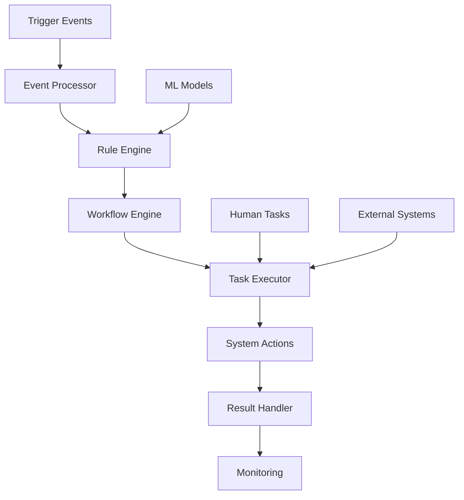

# EPIC-012: Intelligent Automation Platform
**Epic ID:** EPIC-012
**Priority:** P1
**Estimated Story Points:** 44
**Projected Timeline:** Weeks 10-11 (Sprint 3.2)
**Squad:** AI/Data Team

---

## 📋 Epic Overview

### Business Value Statement
The Intelligent Automation Platform leverages AI and machine learning to automate repetitive healthcare workflows, optimize resource allocation, and proactively identify care opportunities. By reducing manual tasks by 70% and improving operational efficiency by 40%, this platform enables healthcare staff to focus on high-value patient care activities while ensuring consistent, error-free execution of routine processes.

### Strategic Objectives
1. **Workflow Automation:** Eliminate manual, repetitive tasks across clinical and administrative functions
2. **Intelligent Routing:** Optimize patient flow and resource allocation using AI-driven decisions
3. **Proactive Care:** Identify and act on care gaps and opportunities automatically
4. **Cost Reduction:** Reduce operational costs by 30% through intelligent automation
5. **Quality Improvement:** Ensure consistent adherence to best practices and protocols
6. **Staff Satisfaction:** Reduce burnout by automating routine tasks

### Key Stakeholders
- **Primary:** Operations managers, clinical staff, administrative teams
- **Secondary:** IT administrators, quality teams, finance departments
- **External:** Patients, insurance providers, regulatory bodies

---

## 🎯 Success Criteria & KPIs

### Business Metrics
- 70% reduction in manual task completion time
- 40% improvement in operational efficiency
- 50% reduction in appointment no-shows
- 60% increase in care gap closure rates
- 30% reduction in operational costs
- 25% improvement in staff satisfaction scores

### Technical Metrics
- Process 10,000+ automation rules per minute
- < 100ms decision latency for routing algorithms
- 99.9% automation reliability
- < 0.1% error rate in automated decisions
- Support for 500+ concurrent automation workflows
- < 5 minutes to deploy new automation rules

### User Experience Metrics
- Zero-touch automation for 80% of routine tasks
- < 2 clicks to override automation decisions
- 95% accuracy in predictive recommendations
- Real-time visibility into automation status
- < 1 minute to create simple automation rules

---

## 📊 User Stories & Acceptance Criteria

### US-12.1: Workflow Automation Engine
**As an** operations manager
**I want to** create and manage automated workflows without coding
**So that I can** reduce manual tasks and improve consistency

#### Acceptance Criteria:
1. **Workflow Designer:**
   - [ ] Visual drag-and-drop workflow builder
   - [ ] 50+ pre-built workflow templates
   - [ ] Conditional logic and branching
   - [ ] Loop and iteration support
   - [ ] Error handling and retry logic
   - [ ] Parallel execution paths

2. **Trigger Management:**
   - [ ] Time-based triggers (cron expressions)
   - [ ] Event-based triggers (webhooks, events)
   - [ ] Condition-based triggers (thresholds)
   - [ ] Manual triggers with parameters
   - [ ] API-triggered workflows
   - [ ] File upload triggers

3. **Action Library:**
   - [ ] Database operations (CRUD)
   - [ ] API calls (REST, SOAP, GraphQL)
   - [ ] Email/SMS/notification actions
   - [ ] Document generation
   - [ ] Data transformation
   - [ ] Human-in-the-loop tasks

#### Story Points: 8
#### Priority: P0

---

### US-12.2: Smart Appointment Management
**As a** scheduling coordinator
**I want** AI to optimize appointment scheduling automatically
**So that** we maximize provider utilization and minimize patient wait times

#### Acceptance Criteria:
1. **Intelligent Scheduling:**
   - [ ] AI-powered slot optimization
   - [ ] Automatic double-booking for predicted no-shows
   - [ ] Smart overbooking based on historical patterns
   - [ ] Provider preference learning
   - [ ] Patient preference consideration
   - [ ] Travel time calculation for home visits

2. **No-Show Prevention:**
   - [ ] Predictive no-show scoring
   - [ ] Automated reminder escalation
   - [ ] Smart rescheduling for high-risk appointments
   - [ ] Waitlist management and auto-fill
   - [ ] Cancellation pattern analysis
   - [ ] Intervention recommendations

3. **Resource Optimization:**
   - [ ] Room allocation optimization
   - [ ] Equipment scheduling
   - [ ] Staff assignment based on skills
   - [ ] Peak time load balancing
   - [ ] Bottleneck identification
   - [ ] Capacity planning

#### Story Points: 8
#### Priority: P0

---

### US-12.3: Automated Care Gap Detection
**As a** care coordinator
**I want** the system to automatically identify and act on care gaps
**So that** we improve patient outcomes and quality scores

#### Acceptance Criteria:
1. **Gap Identification:**
   - [ ] Real-time care gap detection
   - [ ] Preventive care gap analysis
   - [ ] Medication adherence gaps
   - [ ] Follow-up appointment gaps
   - [ ] Screening overdue alerts
   - [ ] Chronic disease management gaps

2. **Automated Interventions:**
   - [ ] Patient outreach campaigns
   - [ ] Provider alert generation
   - [ ] Appointment auto-scheduling
   - [ ] Educational content delivery
   - [ ] Prescription renewal reminders
   - [ ] Lab order generation

3. **Prioritization Logic:**
   - [ ] Risk-based prioritization
   - [ ] Cost-benefit analysis
   - [ ] Resource availability consideration
   - [ ] Patient engagement likelihood
   - [ ] Clinical urgency scoring
   - [ ] Regulatory compliance priority

#### Story Points: 5
#### Priority: P0

---

### US-12.4: Intelligent Document Processing
**As a** medical records clerk
**I want** AI to automatically process and route documents
**So that** we reduce manual data entry and improve accuracy

#### Acceptance Criteria:
1. **Document Intelligence:**
   - [ ] OCR with 99%+ accuracy
   - [ ] Intelligent document classification
   - [ ] Key data extraction (NER)
   - [ ] Handwriting recognition
   - [ ] Multi-language support
   - [ ] Table and form extraction

2. **Automated Processing:**
   - [ ] Auto-routing to appropriate departments
   - [ ] Data validation and verification
   - [ ] Duplicate detection
   - [ ] Missing information identification
   - [ ] Compliance checking
   - [ ] Quality assurance

3. **Integration Actions:**
   - [ ] EHR data population
   - [ ] Billing system updates
   - [ ] Insurance verification
   - [ ] Prior authorization submission
   - [ ] Registry reporting
   - [ ] Audit trail generation

#### Story Points: 8
#### Priority: P1

---

### US-12.5: Proactive Patient Outreach
**As a** population health manager
**I want** automated, personalized patient engagement campaigns
**So that** we improve patient activation and health outcomes

#### Acceptance Criteria:
1. **Campaign Management:**
   - [ ] Multi-channel campaign orchestration
   - [ ] A/B testing framework
   - [ ] Personalization engine
   - [ ] Timing optimization
   - [ ] Frequency capping
   - [ ] Budget management

2. **Content Personalization:**
   - [ ] Dynamic content generation
   - [ ] Language preference support
   - [ ] Health literacy adjustment
   - [ ] Cultural sensitivity
   - [ ] Channel preference respect
   - [ ] Message tone optimization

3. **Engagement Tracking:**
   - [ ] Response rate monitoring
   - [ ] Conversion tracking
   - [ ] Engagement scoring
   - [ ] Campaign ROI analysis
   - [ ] Patient journey mapping
   - [ ] Outcome attribution

#### Story Points: 5
#### Priority: P1

---

### US-12.6: Clinical Task Automation
**As a** clinical staff member
**I want** routine clinical tasks automated
**So that** I can focus on patient care

#### Acceptance Criteria:
1. **Clinical Workflows:**
   - [ ] Lab result triage and routing
   - [ ] Medication refill processing
   - [ ] Referral management
   - [ ] Pre-visit planning
   - [ ] Care plan updates
   - [ ] Registry reporting

2. **Decision Support:**
   - [ ] Protocol-based recommendations
   - [ ] Alert prioritization
   - [ ] Risk stratification
   - [ ] Escalation rules
   - [ ] Override tracking
   - [ ] Outcome monitoring

3. **Safety Mechanisms:**
   - [ ] Clinical validation rules
   - [ ] High-risk flagging
   - [ ] Human review requirements
   - [ ] Audit capabilities
   - [ ] Rollback mechanisms
   - [ ] Error reporting

#### Story Points: 8
#### Priority: P0

---

### US-12.7: Revenue Cycle Automation
**As a** billing manager
**I want** automated revenue cycle workflows
**So that** we reduce denials and accelerate collections

#### Acceptance Criteria:
1. **Claims Automation:**
   - [ ] Automatic claim generation
   - [ ] Pre-submission validation
   - [ ] Denial prediction and prevention
   - [ ] Auto-correction of errors
   - [ ] Resubmission automation
   - [ ] Payment posting

2. **Prior Authorization:**
   - [ ] Eligibility checking
   - [ ] Requirements identification
   - [ ] Documentation gathering
   - [ ] Submission automation
   - [ ] Status tracking
   - [ ] Appeal generation

3. **Collections Optimization:**
   - [ ] Payment probability scoring
   - [ ] Automated payment plans
   - [ ] Dunning letter generation
   - [ ] Collection agency routing
   - [ ] Write-off recommendations
   - [ ] Financial assistance screening

#### Story Points: 8
#### Priority: P1

---

## 🔨 Technical Implementation Tasks

### Automation Engine Development

#### Task 12.1: Workflow Engine Core
**Description:** Build the core workflow execution engine
**Assigned to:** Senior Backend Engineer
**Priority:** P0
**Estimated Hours:** 40

**Sub-tasks:**
- [ ] Design workflow execution architecture
- [ ] Implement BPMN 2.0 engine
- [ ] Build state management system
- [ ] Create workflow versioning
- [ ] Implement parallel execution
- [ ] Build compensation/rollback
- [ ] Setup monitoring hooks
- [ ] Create debugging interface
- [ ] Implement workflow persistence
- [ ] Build clustering support

**Technical Requirements:**
```python
from typing import Dict, List, Optional, Any
from dataclasses import dataclass
from enum import Enum
import asyncio
from datetime import datetime
import zeep  # for SOAP
import httpx  # for REST
from temporalio import workflow, activity
from temporalio.client import Client
from temporalio.worker import Worker

class WorkflowStatus(Enum):
    PENDING = "pending"
    RUNNING = "running"
    PAUSED = "paused"
    COMPLETED = "completed"
    FAILED = "failed"
    CANCELLED = "cancelled"

@dataclass
class WorkflowDefinition:
    id: str
    name: str
    version: str
    triggers: List[Dict]
    steps: List[Dict]
    error_handlers: List[Dict]
    timeout: int = 3600
    retry_policy: Dict = None

class WorkflowEngine:
    def __init__(self):
        self.workflows: Dict[str, WorkflowDefinition] = {}
        self.executions: Dict[str, WorkflowExecution] = {}
        self.temporal_client = None

    async def initialize(self):
        """Initialize Temporal workflow engine"""
        self.temporal_client = await Client.connect("localhost:7233")

    async def register_workflow(self, definition: WorkflowDefinition):
        """Register a new workflow definition"""

        # Validate workflow
        await self._validate_workflow(definition)

        # Store definition
        self.workflows[definition.id] = definition

        # Register with Temporal
        @workflow.defn(name=definition.name)
        class DynamicWorkflow:
            @workflow.run
            async def run(self, input_data: Dict) -> Dict:
                return await self._execute_workflow_steps(
                    definition, input_data
                )

        return definition.id

    async def execute_workflow(
        self,
        workflow_id: str,
        input_data: Dict,
        correlation_id: Optional[str] = None
    ) -> str:
        """Execute a workflow instance"""

        if workflow_id not in self.workflows:
            raise ValueError(f"Workflow {workflow_id} not found")

        definition = self.workflows[workflow_id]
        execution_id = self._generate_execution_id()

        # Start workflow execution
        handle = await self.temporal_client.start_workflow(
            definition.name,
            input_data,
            id=execution_id,
            task_queue="automation-queue"
        )

        # Track execution
        self.executions[execution_id] = WorkflowExecution(
            execution_id=execution_id,
            workflow_id=workflow_id,
            status=WorkflowStatus.RUNNING,
            input_data=input_data,
            correlation_id=correlation_id,
            started_at=datetime.utcnow()
        )

        return execution_id

    async def _execute_workflow_steps(
        self,
        definition: WorkflowDefinition,
        context: Dict
    ) -> Dict:
        """Execute workflow steps sequentially or in parallel"""

        for step in definition.steps:
            try:
                if step['type'] == 'parallel':
                    # Execute parallel branches
                    results = await asyncio.gather(*[
                        self._execute_step(branch, context)
                        for branch in step['branches']
                    ])
                    context['parallel_results'] = results

                elif step['type'] == 'conditional':
                    # Evaluate condition
                    if await self._evaluate_condition(
                        step['condition'], context
                    ):
                        context = await self._execute_step(
                            step['then_branch'], context
                        )
                    elif 'else_branch' in step:
                        context = await self._execute_step(
                            step['else_branch'], context
                        )

                elif step['type'] == 'loop':
                    # Execute loop
                    items = self._get_loop_items(step['items'], context)
                    loop_results = []

                    for item in items:
                        loop_context = {**context, 'item': item}
                        result = await self._execute_step(
                            step['body'], loop_context
                        )
                        loop_results.append(result)

                    context['loop_results'] = loop_results

                else:
                    # Execute single step
                    context = await self._execute_step(step, context)

            except Exception as e:
                # Handle errors
                if definition.error_handlers:
                    context = await self._handle_error(
                        e, step, context, definition.error_handlers
                    )
                else:
                    raise

        return context

    async def _execute_step(
        self,
        step: Dict,
        context: Dict
    ) -> Dict:
        """Execute a single workflow step"""

        step_type = step['action']['type']

        if step_type == 'http':
            return await self._execute_http_action(
                step['action'], context
            )
        elif step_type == 'database':
            return await self._execute_database_action(
                step['action'], context
            )
        elif step_type == 'email':
            return await self._execute_email_action(
                step['action'], context
            )
        elif step_type == 'transform':
            return await self._execute_transform_action(
                step['action'], context
            )
        elif step_type == 'human_task':
            return await self._execute_human_task(
                step['action'], context
            )
        else:
            raise ValueError(f"Unknown step type: {step_type}")

# Workflow Activities
@activity.defn
async def http_request_activity(
    url: str,
    method: str,
    headers: Dict,
    body: Optional[Dict] = None
) -> Dict:
    """Execute HTTP request as workflow activity"""

    async with httpx.AsyncClient() as client:
        response = await client.request(
            method=method,
            url=url,
            headers=headers,
            json=body
        )

        return {
            'status_code': response.status_code,
            'headers': dict(response.headers),
            'body': response.json() if response.content else None
        }

@activity.defn
async def database_query_activity(
    connection_string: str,
    query: str,
    params: Optional[List] = None
) -> List[Dict]:
    """Execute database query as workflow activity"""

    import asyncpg

    conn = await asyncpg.connect(connection_string)
    try:
        if params:
            results = await conn.fetch(query, *params)
        else:
            results = await conn.fetch(query)

        return [dict(record) for record in results]
    finally:
        await conn.close()

@activity.defn
async def ml_prediction_activity(
    model_name: str,
    input_features: Dict
) -> Dict:
    """Execute ML prediction as workflow activity"""

    # Load model from registry
    model = await load_model_from_registry(model_name)

    # Make prediction
    prediction = model.predict(input_features)

    return {
        'model': model_name,
        'prediction': prediction,
        'confidence': model.predict_proba(input_features).max(),
        'timestamp': datetime.utcnow().isoformat()
    }

# Workflow Templates
class WorkflowTemplates:
    @staticmethod
    def appointment_optimization_workflow() -> WorkflowDefinition:
        """Template for appointment optimization workflow"""

        return WorkflowDefinition(
            id="appointment_optimization",
            name="Appointment Optimization Workflow",
            version="1.0",
            triggers=[
                {
                    'type': 'schedule',
                    'cron': '0 6 * * *'  # Daily at 6 AM
                }
            ],
            steps=[
                {
                    'name': 'fetch_appointments',
                    'action': {
                        'type': 'database',
                        'query': """
                            SELECT * FROM appointments
                            WHERE date = CURRENT_DATE + 1
                            AND status = 'scheduled'
                        """
                    }
                },
                {
                    'name': 'predict_no_shows',
                    'type': 'loop',
                    'items': '${fetch_appointments.results}',
                    'body': {
                        'action': {
                            'type': 'ml_prediction',
                            'model': 'no_show_predictor',
                            'features': '${item}'
                        }
                    }
                },
                {
                    'name': 'optimize_schedule',
                    'action': {
                        'type': 'http',
                        'method': 'POST',
                        'url': '${env.OPTIMIZATION_API}/optimize',
                        'body': {
                            'appointments': '${fetch_appointments.results}',
                            'predictions': '${predict_no_shows.results}'
                        }
                    }
                },
                {
                    'name': 'send_notifications',
                    'type': 'parallel',
                    'branches': [
                        {
                            'action': {
                                'type': 'email',
                                'template': 'appointment_reminder',
                                'recipients': '${optimize_schedule.confirmed_patients}'
                            }
                        },
                        {
                            'action': {
                                'type': 'sms',
                                'template': 'appointment_reminder',
                                'recipients': '${optimize_schedule.waitlist_patients}'
                            }
                        }
                    ]
                }
            ],
            error_handlers=[
                {
                    'error_type': 'PredictionError',
                    'action': {
                        'type': 'notification',
                        'channel': 'slack',
                        'message': 'Prediction failed, using default schedule'
                    }
                }
            ]
        )
```

---

#### Task 12.2: Rule Engine Implementation
**Description:** Build business rule engine for automation decisions
**Assigned to:** Backend Engineer
**Priority:** P0
**Estimated Hours:** 32

**Sub-tasks:**
- [ ] Design rule schema and DSL
- [ ] Implement rule parser
- [ ] Build rule evaluation engine
- [ ] Create rule versioning
- [ ] Implement conflict resolution
- [ ] Build rule testing framework
- [ ] Setup rule monitoring
- [ ] Create rule management API
- [ ] Implement rule caching
- [ ] Build rule analytics

**Technical Requirements:**
```python
from typing import Dict, List, Any, Optional
from dataclasses import dataclass
from enum import Enum
import json
from datetime import datetime
import ast
import operator

class RuleType(Enum):
    SIMPLE = "simple"
    COMPLEX = "complex"
    DECISION_TABLE = "decision_table"
    DECISION_TREE = "decision_tree"

@dataclass
class Rule:
    id: str
    name: str
    description: str
    type: RuleType
    conditions: List[Dict]
    actions: List[Dict]
    priority: int = 0
    enabled: bool = True
    effective_date: Optional[datetime] = None
    expiry_date: Optional[datetime] = None

class RuleEngine:
    def __init__(self):
        self.rules: Dict[str, Rule] = {}
        self.rule_sets: Dict[str, List[str]] = {}
        self.operators = {
            'eq': operator.eq,
            'ne': operator.ne,
            'lt': operator.lt,
            'lte': operator.le,
            'gt': operator.gt,
            'gte': operator.ge,
            'in': lambda x, y: x in y,
            'not_in': lambda x, y: x not in y,
            'contains': lambda x, y: y in x,
            'starts_with': lambda x, y: x.startswith(y),
            'ends_with': lambda x, y: x.endswith(y),
            'regex': lambda x, y: bool(re.match(y, x))
        }

    def add_rule(self, rule: Rule) -> None:
        """Add a new rule to the engine"""
        self.rules[rule.id] = rule

    def evaluate_rules(
        self,
        context: Dict[str, Any],
        rule_set: Optional[str] = None
    ) -> List[Dict]:
        """Evaluate all applicable rules against context"""

        # Get applicable rules
        if rule_set and rule_set in self.rule_sets:
            rule_ids = self.rule_sets[rule_set]
            applicable_rules = [
                self.rules[rid] for rid in rule_ids
                if rid in self.rules
            ]
        else:
            applicable_rules = list(self.rules.values())

        # Filter by date and enabled status
        current_date = datetime.utcnow()
        applicable_rules = [
            rule for rule in applicable_rules
            if rule.enabled
            and (not rule.effective_date or rule.effective_date <= current_date)
            and (not rule.expiry_date or rule.expiry_date >= current_date)
        ]

        # Sort by priority
        applicable_rules.sort(key=lambda x: x.priority, reverse=True)

        # Evaluate rules
        triggered_actions = []

        for rule in applicable_rules:
            if self._evaluate_conditions(rule.conditions, context):
                actions = self._prepare_actions(rule.actions, context)
                triggered_actions.append({
                    'rule_id': rule.id,
                    'rule_name': rule.name,
                    'actions': actions,
                    'timestamp': datetime.utcnow().isoformat()
                })

        return triggered_actions

    def _evaluate_conditions(
        self,
        conditions: List[Dict],
        context: Dict
    ) -> bool:
        """Evaluate rule conditions"""

        if not conditions:
            return True

        # Handle AND/OR logic
        logic_operator = conditions[0].get('logic', 'AND')

        if logic_operator == 'AND':
            return all(
                self._evaluate_condition(cond, context)
                for cond in conditions
            )
        elif logic_operator == 'OR':
            return any(
                self._evaluate_condition(cond, context)
                for cond in conditions
            )
        else:
            # Complex nested logic
            return self._evaluate_complex_conditions(conditions, context)

    def _evaluate_condition(
        self,
        condition: Dict,
        context: Dict
    ) -> bool:
        """Evaluate a single condition"""

        field = condition['field']
        operator_name = condition['operator']
        value = condition['value']

        # Get field value from context
        field_value = self._get_field_value(field, context)

        # Get operator function
        op_func = self.operators.get(operator_name)

        if not op_func:
            raise ValueError(f"Unknown operator: {operator_name}")

        # Evaluate condition
        try:
            return op_func(field_value, value)
        except Exception as e:
            # Log error and return False
            print(f"Error evaluating condition: {e}")
            return False

    def _get_field_value(
        self,
        field_path: str,
        context: Dict
    ) -> Any:
        """Get field value from context using dot notation"""

        parts = field_path.split('.')
        value = context

        for part in parts:
            if isinstance(value, dict):
                value = value.get(part)
            elif isinstance(value, list) and part.isdigit():
                index = int(part)
                value = value[index] if index < len(value) else None
            else:
                return None

        return value

    def _prepare_actions(
        self,
        actions: List[Dict],
        context: Dict
    ) -> List[Dict]:
        """Prepare actions with context values"""

        prepared_actions = []

        for action in actions:
            prepared_action = {
                'type': action['type'],
                'parameters': {}
            }

            # Substitute variables in parameters
            for key, value in action.get('parameters', {}).items():
                if isinstance(value, str) and value.startswith('${'):
                    # Variable substitution
                    var_path = value[2:-1]
                    prepared_action['parameters'][key] = self._get_field_value(
                        var_path, context
                    )
                else:
                    prepared_action['parameters'][key] = value

            prepared_actions.append(prepared_action)

        return prepared_actions

# Clinical Rules Examples
class ClinicalRules:
    @staticmethod
    def create_readmission_risk_rule() -> Rule:
        """Rule for identifying high readmission risk patients"""

        return Rule(
            id="readmission_risk_001",
            name="High Readmission Risk Alert",
            description="Identify patients at high risk of readmission",
            type=RuleType.COMPLEX,
            conditions=[
                {
                    'logic': 'AND',
                    'conditions': [
                        {
                            'field': 'patient.readmission_score',
                            'operator': 'gte',
                            'value': 0.7
                        },
                        {
                            'field': 'patient.discharge_date',
                            'operator': 'lt',
                            'value': '${today - 30d}'
                        },
                        {
                            'logic': 'OR',
                            'conditions': [
                                {
                                    'field': 'patient.chronic_conditions',
                                    'operator': 'gte',
                                    'value': 3
                                },
                                {
                                    'field': 'patient.age',
                                    'operator': 'gte',
                                    'value': 65
                                }
                            ]
                        }
                    ]
                }
            ],
            actions=[
                {
                    'type': 'create_task',
                    'parameters': {
                        'task_type': 'follow_up_call',
                        'priority': 'high',
                        'assigned_to': 'care_coordinator',
                        'due_date': '${today + 1d}'
                    }
                },
                {
                    'type': 'send_alert',
                    'parameters': {
                        'recipient': '${patient.primary_provider}',
                        'message': 'Patient at high risk of readmission',
                        'severity': 'warning'
                    }
                },
                {
                    'type': 'schedule_appointment',
                    'parameters': {
                        'appointment_type': 'follow_up',
                        'provider': '${patient.primary_provider}',
                        'timeframe': '48_hours'
                    }
                }
            ],
            priority: 100
        )

    @staticmethod
    def create_care_gap_rule() -> Rule:
        """Rule for identifying care gaps"""

        return Rule(
            id="care_gap_001",
            name="Preventive Care Gap Detection",
            description="Identify patients missing preventive care",
            type=RuleType.DECISION_TABLE,
            conditions=[
                {
                    'field': 'patient.age',
                    'operator': 'gte',
                    'value': 50
                },
                {
                    'field': 'patient.last_colonoscopy_date',
                    'operator': 'lt',
                    'value': '${today - 10y}'
                }
            ],
            actions=[
                {
                    'type': 'add_care_gap',
                    'parameters': {
                        'gap_type': 'preventive_screening',
                        'description': 'Colonoscopy overdue',
                        'priority': 'medium'
                    }
                },
                {
                    'type': 'send_communication',
                    'parameters': {
                        'channel': 'patient_portal',
                        'template': 'screening_reminder',
                        'screening_type': 'colonoscopy'
                    }
                }
            ],
            priority: 50
        )
```

---

#### Task 12.3: Machine Learning Pipeline
**Description:** Build ML pipeline for intelligent automation
**Assigned to:** Data Scientist
**Priority:** P0
**Estimated Hours:** 40

**Sub-tasks:**
- [ ] Build no-show prediction model
- [ ] Create appointment optimization algorithm
- [ ] Implement resource allocation model
- [ ] Build care gap prediction
- [ ] Create routing optimization
- [ ] Implement anomaly detection
- [ ] Build model monitoring
- [ ] Create feature engineering pipeline
- [ ] Implement model versioning
- [ ] Setup A/B testing framework

---

#### Task 12.4: Event Processing System
**Description:** Build real-time event processing for automation triggers
**Assigned to:** Backend Engineer
**Priority:** P0
**Estimated Hours:** 32

**Sub-tasks:**
- [ ] Setup event streaming infrastructure
- [ ] Build event correlation engine
- [ ] Implement complex event processing
- [ ] Create event filtering rules
- [ ] Build event aggregation
- [ ] Implement event replay capability
- [ ] Setup event monitoring
- [ ] Create event storage
- [ ] Build event analytics
- [ ] Implement dead letter queue

---

### User Interface Development

#### Task 12.5: Workflow Designer UI
**Description:** Build visual workflow designer interface
**Assigned to:** Frontend Developer
**Priority:** P0
**Estimated Hours:** 40

**Sub-tasks:**
- [ ] Create drag-drop workflow canvas
- [ ] Build component palette
- [ ] Implement connection drawing
- [ ] Create property panels
- [ ] Build validation UI
- [ ] Implement zoom/pan controls
- [ ] Create workflow templates
- [ ] Build version comparison
- [ ] Implement collaborative editing
- [ ] Create workflow simulator

**Technical Requirements:**
```typescript
import React, { useState, useCallback, useRef } from 'react';
import ReactFlow, {
  Node,
  Edge,
  Controls,
  Background,
  applyNodeChanges,
  applyEdgeChanges,
  addEdge,
  MarkerType,
  NodeTypes,
  EdgeTypes
} from 'reactflow';
import 'reactflow/dist/style.css';
import { Box, Paper, Drawer, IconButton } from '@mui/material';
import { useDrop } from 'react-dnd';

interface WorkflowNode extends Node {
  data: {
    label: string;
    type: string;
    config: any;
    validation?: string[];
  };
}

interface WorkflowDesignerProps {
  workflowId?: string;
  onSave: (workflow: any) => void;
}

export const WorkflowDesigner: React.FC<WorkflowDesignerProps> = ({
  workflowId,
  onSave
}) => {
  const [nodes, setNodes] = useState<WorkflowNode[]>([]);
  const [edges, setEdges] = useState<Edge[]>([]);
  const [selectedNode, setSelectedNode] = useState<WorkflowNode | null>(null);
  const [showProperties, setShowProperties] = useState(false);

  const reactFlowWrapper = useRef<HTMLDivElement>(null);
  const [reactFlowInstance, setReactFlowInstance] = useState<any>(null);

  // Custom node components
  const nodeTypes: NodeTypes = {
    trigger: TriggerNode,
    action: ActionNode,
    condition: ConditionNode,
    loop: LoopNode,
    parallel: ParallelNode,
    human: HumanTaskNode
  };

  // Drop handler for adding new nodes
  const [{ isOver }, dropRef] = useDrop({
    accept: 'workflow-component',
    drop: (item: any, monitor) => {
      const reactFlowBounds = reactFlowWrapper.current?.getBoundingClientRect();
      if (!reactFlowBounds || !reactFlowInstance) return;

      const position = reactFlowInstance.project({
        x: monitor.getClientOffset()!.x - reactFlowBounds.left,
        y: monitor.getClientOffset()!.y - reactFlowBounds.top
      });

      const newNode: WorkflowNode = {
        id: `node_${Date.now()}`,
        type: item.nodeType,
        position,
        data: {
          label: item.label,
          type: item.componentType,
          config: item.defaultConfig || {}
        }
      };

      setNodes((nds) => nds.concat(newNode));
    },
    collect: (monitor) => ({
      isOver: monitor.isOver()
    })
  });

  // Node change handlers
  const onNodesChange = useCallback(
    (changes) => setNodes((nds) => applyNodeChanges(changes, nds)),
    []
  );

  const onEdgesChange = useCallback(
    (changes) => setEdges((eds) => applyEdgeChanges(changes, eds)),
    []
  );

  const onConnect = useCallback(
    (params) => {
      const edge = {
        ...params,
        type: 'smoothstep',
        animated: true,
        markerEnd: {
          type: MarkerType.ArrowClosed
        }
      };
      setEdges((eds) => addEdge(edge, eds));
    },
    []
  );

  const onNodeClick = useCallback((event, node: WorkflowNode) => {
    setSelectedNode(node);
    setShowProperties(true);
  }, []);

  // Validate workflow
  const validateWorkflow = (): boolean => {
    const errors: string[] = [];

    // Check for start node
    const startNodes = nodes.filter(n => n.type === 'trigger');
    if (startNodes.length === 0) {
      errors.push('Workflow must have at least one trigger');
    }

    // Check for disconnected nodes
    const connectedNodeIds = new Set<string>();
    edges.forEach(edge => {
      connectedNodeIds.add(edge.source);
      connectedNodeIds.add(edge.target);
    });

    nodes.forEach(node => {
      if (node.type !== 'trigger' && !connectedNodeIds.has(node.id)) {
        errors.push(`Node "${node.data.label}" is not connected`);
      }
    });

    // Check for cycles
    if (hasCycle(nodes, edges)) {
      errors.push('Workflow contains a cycle');
    }

    if (errors.length > 0) {
      console.error('Workflow validation errors:', errors);
      return false;
    }

    return true;
  };

  // Convert to workflow definition
  const toWorkflowDefinition = () => {
    const triggers = nodes
      .filter(n => n.type === 'trigger')
      .map(n => n.data.config);

    const steps = nodes
      .filter(n => n.type !== 'trigger')
      .map(node => {
        const incoming = edges.filter(e => e.target === node.id);
        const outgoing = edges.filter(e => e.source === node.id);

        return {
          id: node.id,
          name: node.data.label,
          type: node.type,
          action: node.data.config,
          dependencies: incoming.map(e => e.source),
          next: outgoing.map(e => e.target)
        };
      });

    return {
      name: 'Workflow',
      triggers,
      steps,
      edges
    };
  };

  const handleSave = () => {
    if (validateWorkflow()) {
      const workflow = toWorkflowDefinition();
      onSave(workflow);
    }
  };

  return (
    <Box sx={{ height: '100vh', display: 'flex' }}>
      {/* Component Palette */}
      <Paper sx={{ width: 250, p: 2 }}>
        <Typography variant="h6">Components</Typography>
        <WorkflowComponentPalette />
      </Paper>

      {/* Workflow Canvas */}
      <Box sx={{ flex: 1, position: 'relative' }}>
        <div
          ref={(el) => {
            reactFlowWrapper.current = el;
            dropRef(el);
          }}
          style={{ height: '100%', backgroundColor: isOver ? '#f0f0f0' : 'white' }}
        >
          <ReactFlow
            nodes={nodes}
            edges={edges}
            onNodesChange={onNodesChange}
            onEdgesChange={onEdgesChange}
            onConnect={onConnect}
            onNodeClick={onNodeClick}
            onInit={setReactFlowInstance}
            nodeTypes={nodeTypes}
            fitView
          >
            <Background variant="dots" gap={12} size={1} />
            <Controls />
          </ReactFlow>
        </div>

        {/* Toolbar */}
        <Paper sx={{ position: 'absolute', top: 10, right: 10, p: 1 }}>
          <IconButton onClick={handleSave}>
            <SaveIcon />
          </IconButton>
          <IconButton onClick={validateWorkflow}>
            <CheckCircleIcon />
          </IconButton>
          <IconButton>
            <PlayArrowIcon />
          </IconButton>
        </Paper>
      </Box>

      {/* Properties Panel */}
      <Drawer
        anchor="right"
        open={showProperties}
        onClose={() => setShowProperties(false)}
      >
        <Box sx={{ width: 350, p: 2 }}>
          {selectedNode && (
            <NodePropertiesPanel
              node={selectedNode}
              onChange={(config) => {
                setNodes(nodes.map(n =>
                  n.id === selectedNode.id
                    ? { ...n, data: { ...n.data, config } }
                    : n
                ));
              }}
            />
          )}
        </Box>
      </Drawer>
    </Box>
  );
};

// Component Palette
const WorkflowComponentPalette: React.FC = () => {
  const components = [
    {
      category: 'Triggers',
      items: [
        { type: 'schedule', label: 'Schedule', icon: <ScheduleIcon /> },
        { type: 'webhook', label: 'Webhook', icon: <WebhookIcon /> },
        { type: 'event', label: 'Event', icon: <EventIcon /> },
        { type: 'manual', label: 'Manual', icon: <PlayIcon /> }
      ]
    },
    {
      category: 'Actions',
      items: [
        { type: 'http', label: 'HTTP Request', icon: <HttpIcon /> },
        { type: 'database', label: 'Database', icon: <DatabaseIcon /> },
        { type: 'email', label: 'Email', icon: <EmailIcon /> },
        { type: 'sms', label: 'SMS', icon: <SmsIcon /> },
        { type: 'transform', label: 'Transform', icon: <TransformIcon /> }
      ]
    },
    {
      category: 'Logic',
      items: [
        { type: 'condition', label: 'Condition', icon: <FilterIcon /> },
        { type: 'loop', label: 'Loop', icon: <LoopIcon /> },
        { type: 'parallel', label: 'Parallel', icon: <ParallelIcon /> },
        { type: 'wait', label: 'Wait', icon: <TimerIcon /> }
      ]
    },
    {
      category: 'Human Tasks',
      items: [
        { type: 'approval', label: 'Approval', icon: <ApprovalIcon /> },
        { type: 'review', label: 'Review', icon: <ReviewIcon /> },
        { type: 'input', label: 'Input', icon: <InputIcon /> }
      ]
    }
  ];

  return (
    <Box>
      {components.map((category) => (
        <Box key={category.category} sx={{ mb: 2 }}>
          <Typography variant="subtitle2" sx={{ mb: 1 }}>
            {category.category}
          </Typography>
          {category.items.map((item) => (
            <DraggableComponent
              key={item.type}
              componentType={item.type}
              label={item.label}
              icon={item.icon}
            />
          ))}
        </Box>
      ))}
    </Box>
  );
};

// Custom Node Components
const ActionNode: React.FC<any> = ({ data }) => {
  return (
    <Paper
      sx={{
        p: 2,
        minWidth: 150,
        border: '2px solid #4CAF50',
        borderRadius: 2
      }}
    >
      <Box sx={{ display: 'flex', alignItems: 'center' }}>
        <ActionIcon sx={{ mr: 1 }} />
        <Typography>{data.label}</Typography>
      </Box>
    </Paper>
  );
};

const ConditionNode: React.FC<any> = ({ data }) => {
  return (
    <Paper
      sx={{
        p: 2,
        minWidth: 150,
        border: '2px solid #2196F3',
        borderRadius: 2,
        transform: 'rotate(45deg)'
      }}
    >
      <Box
        sx={{
          transform: 'rotate(-45deg)',
          display: 'flex',
          alignItems: 'center'
        }}
      >
        <FilterIcon sx={{ mr: 1 }} />
        <Typography>{data.label}</Typography>
      </Box>
    </Paper>
  );
};
```

---

#### Task 12.6: Automation Dashboard
**Description:** Build automation monitoring dashboard
**Assigned to:** Frontend Developer
**Priority:** P0
**Estimated Hours:** 24

**Sub-tasks:**
- [ ] Create automation overview dashboard
- [ ] Build workflow execution monitor
- [ ] Implement performance metrics
- [ ] Create error tracking interface
- [ ] Build automation analytics
- [ ] Implement audit trail viewer
- [ ] Create alert management UI
- [ ] Build automation calendar
- [ ] Implement ROI tracking
- [ ] Create automation recommendations

---

#### Task 12.7: Rule Management Interface
**Description:** Build rule creation and management UI
**Assigned to:** Frontend Developer
**Priority:** P1
**Estimated Hours:** 32

**Sub-tasks:**
- [ ] Create rule builder interface
- [ ] Build decision table editor
- [ ] Implement rule testing UI
- [ ] Create rule versioning interface
- [ ] Build rule simulation tool
- [ ] Implement rule analytics dashboard
- [ ] Create rule library
- [ ] Build rule import/export
- [ ] Implement rule documentation
- [ ] Create rule approval workflow

---

### Integration & Orchestration

#### Task 12.8: System Integration Layer
**Description:** Build integration with existing systems
**Assigned to:** Integration Engineer
**Priority:** P0
**Estimated Hours:** 40

**Sub-tasks:**
- [ ] Build EHR integration adapters
- [ ] Create billing system connectors
- [ ] Implement lab system integration
- [ ] Build pharmacy interfaces
- [ ] Create insurance API connectors
- [ ] Implement scheduling system sync
- [ ] Build document management integration
- [ ] Create communication platform APIs
- [ ] Implement analytics tool connectors
- [ ] Setup monitoring integrations

---

#### Task 12.9: Human-in-the-Loop System
**Description:** Build human task management system
**Assigned to:** Backend Engineer
**Priority:** P1
**Estimated Hours:** 24

**Sub-tasks:**
- [ ] Create task assignment engine
- [ ] Build approval workflow system
- [ ] Implement escalation rules
- [ ] Create task prioritization
- [ ] Build delegation system
- [ ] Implement deadline management
- [ ] Create task notifications
- [ ] Build task analytics
- [ ] Implement workload balancing
- [ ] Create task templates

---

### Monitoring & Optimization

#### Task 12.10: Performance Monitoring
**Description:** Build automation performance monitoring
**Assigned to:** DevOps Engineer
**Priority:** P1
**Estimated Hours:** 24

**Sub-tasks:**
- [ ] Setup performance metrics collection
- [ ] Build execution time tracking
- [ ] Implement resource usage monitoring
- [ ] Create bottleneck detection
- [ ] Build performance dashboards
- [ ] Implement alerting rules
- [ ] Create optimization recommendations
- [ ] Build capacity planning tools
- [ ] Implement SLA monitoring
- [ ] Create performance reports

---

#### Task 12.11: ROI Tracking System
**Description:** Build automation ROI measurement
**Assigned to:** Business Analyst
**Priority:** P2
**Estimated Hours:** 16

**Sub-tasks:**
- [ ] Define ROI metrics
- [ ] Build time savings calculator
- [ ] Implement cost reduction tracking
- [ ] Create quality improvement metrics
- [ ] Build efficiency dashboards
- [ ] Implement comparison reports
- [ ] Create executive summaries
- [ ] Build trend analysis
- [ ] Implement benchmarking
- [ ] Create ROI forecasting

---

## 📐 Technical Architecture

### System Architecture
```yaml
automation_platform:
  workflow_engine:
    orchestration:
      - temporal: "Workflow orchestration"
      - airflow: "Batch job scheduling"

    execution:
      - workers: "Distributed task execution"
      - queue: "Task queuing with Redis"
      - state_management: "Workflow state tracking"

  rule_engine:
    core:
      - drools: "Business rule processing"
      - decision_tables: "Complex decision logic"

    storage:
      - rule_repository: "Version controlled rules"
      - rule_cache: "Performance optimization"

  ml_services:
    models:
      - no_show_prediction: "Appointment optimization"
      - resource_allocation: "Staff scheduling"
      - care_gap_detection: "Proactive care"

    infrastructure:
      - mlflow: "Model management"
      - feature_store: "Feature engineering"

  integration_layer:
    connectors:
      - ehr_adapter: "Clinical system integration"
      - billing_connector: "Revenue cycle"
      - lab_interface: "Lab results"

    messaging:
      - kafka: "Event streaming"
      - rabbitmq: "Task queuing"

  monitoring:
    metrics:
      - prometheus: "Metric collection"
      - grafana: "Visualization"

    logging:
      - elasticsearch: "Log aggregation"
      - kibana: "Log analysis"
```

### Data Flow


---

## 🔒 Security Considerations

### Security Requirements
1. **Access Control:**
   - Role-based permissions for automation creation
   - Approval workflows for critical automations
   - Audit trail for all automation actions

2. **Data Protection:**
   - Encryption of workflow definitions
   - Secure credential storage
   - PHI handling compliance

3. **Operational Security:**
   - Rate limiting on automation execution
   - Resource consumption limits
   - Isolation between tenants

4. **Monitoring:**
   - Anomaly detection in automation behavior
   - Alert on suspicious patterns
   - Compliance reporting

---

## 🧪 Testing Strategy

### Testing Approach
1. **Unit Testing:**
   - Rule evaluation logic
   - Workflow step execution
   - Integration adapters

2. **Integration Testing:**
   - End-to-end workflow execution
   - System integration points
   - Event processing

3. **Performance Testing:**
   - Concurrent workflow execution
   - Rule engine throughput
   - Scalability testing

4. **Validation Testing:**
   - Clinical workflow accuracy
   - Compliance verification
   - Safety mechanism testing

---

## 📋 Rollout Plan

### Phase 1: Core Engine (Week 1)
- Deploy workflow engine
- Implement rule engine
- Basic automation capabilities

### Phase 2: Clinical Automations (Week 2)
- Care gap detection
- Appointment optimization
- Clinical task automation

### Phase 3: Administrative (Week 3)
- Revenue cycle automation
- Document processing
- Administrative workflows

### Phase 4: Advanced Features (Week 4)
- ML model integration
- Complex orchestrations
- Full production rollout

---

## 📊 Success Metrics

### Week 1 Targets
- 10 workflow templates created
- 50 rules defined
- 5 systems integrated

### Month 1 Targets
- 100 active automations
- 70% task automation rate
- 40% efficiency improvement

### Quarter 1 Targets
- 500+ automations running
- 30% cost reduction
- 90% user satisfaction

---

## 🔗 Dependencies

### Technical Dependencies
- EPIC-002: Event architecture for triggers
- EPIC-003: Database for state management
- EPIC-009: AI models for intelligent decisions

### Resource Dependencies
- 1 Senior Backend Engineer
- 1 ML Engineer
- 1 Frontend Developer
- 1 Integration Specialist

---

## 📝 Notes

### Key Decisions
- Chose Temporal for workflow orchestration
- Implemented visual workflow designer
- Prioritized no-code automation creation

### Risks & Mitigations
- **Risk:** Automation errors impacting patient care
  - **Mitigation:** Human-in-the-loop for critical decisions

- **Risk:** System integration complexity
  - **Mitigation:** Standardized adapter framework

---

**Epic Status:** Ready for Implementation
**Last Updated:** November 24, 2024
**Next Review:** Sprint Planning