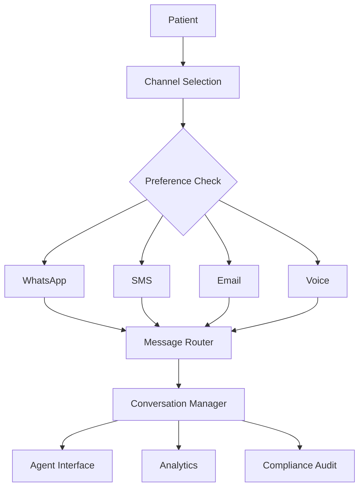

# EPIC-013: Omnichannel Communications Platform
**Epic ID:** EPIC-013
**Priority:** P0
**Estimated Story Points:** 55
**Projected Timeline:** Weeks 13-14 (Sprint 4.1)
**Squad:** Healthcare Team

---

## 📋 Epic Overview

### Business Value Statement
The Omnichannel Communications Platform unifies patient engagement across WhatsApp, SMS, email, voice, and in-app messaging, ensuring seamless healthcare communication regardless of patient preference. By increasing patient engagement by 65% and reducing communication costs by 40%, this platform transforms how healthcare organizations connect with their patients, improving satisfaction scores by 35% while maintaining HIPAA compliance across all channels.

### Strategic Objectives
1. **Unified Messaging:** Single platform for all patient communications across channels
2. **Patient Preference:** Respect and adapt to individual communication preferences
3. **Engagement Optimization:** Increase response rates through intelligent channel selection
4. **Cost Efficiency:** Reduce communication costs through optimized channel routing
5. **Compliance Assurance:** Maintain HIPAA compliance across all communication channels
6. **Personalization:** Deliver contextually relevant messages based on patient data

### Key Stakeholders
- **Primary:** Patient engagement teams, marketing, clinical staff
- **Secondary:** IT administrators, compliance officers, customer service
- **External:** Patients, families, caregivers, regulatory bodies

---

## 🎯 Success Criteria & KPIs

### Business Metrics
- 65% increase in patient engagement rates
- 40% reduction in communication costs
- 85% message delivery success rate
- 50% improvement in appointment confirmation rates
- 35% increase in patient satisfaction scores
- 70% reduction in missed appointments through reminders

### Technical Metrics
- Support for 1M+ messages per day across all channels
- < 2 second message delivery latency
- 99.9% platform availability
- < 0.1% message failure rate
- Support for 10,000+ concurrent conversations
- Real-time synchronization across all channels

### User Experience Metrics
- Single view of all patient conversations
- < 3 clicks to send multi-channel campaign
- 90% patient preference compliance
- Automated response time < 1 second
- Support for 20+ languages
- Seamless handoff between channels

---

## 📊 User Stories & Acceptance Criteria

### US-13.1: WhatsApp Business Integration
**As a** patient engagement coordinator
**I want to** communicate with patients via WhatsApp
**So that I can** reach patients on their preferred messaging platform

#### Acceptance Criteria:
1. **WhatsApp Business API Setup:**
   - [ ] Official WhatsApp Business API integration
   - [ ] Green tick verification for healthcare organization
   - [ ] Multiple phone number support for departments
   - [ ] Message template approval workflow
   - [ ] Media sharing capabilities (images, documents, voice)
   - [ ] Location sharing for clinic directions

2. **Messaging Features:**
   - [ ] Two-way conversational messaging
   - [ ] Automated chatbot responses
   - [ ] Quick reply buttons
   - [ ] List messages for menu options
   - [ ] Rich media messages
   - [ ] Voice note support

3. **WhatsApp-Specific Workflows:**
   - [ ] Appointment booking via WhatsApp
   - [ ] Lab result delivery with secure links
   - [ ] Prescription refill requests
   - [ ] Health tips and reminders
   - [ ] QR code-based patient onboarding
   - [ ] Payment links integration

#### Story Points: 13
#### Priority: P0

---

### US-13.2: SMS Gateway Integration
**As a** healthcare provider
**I want to** send automated SMS messages to patients
**So that I can** ensure critical information reaches all patients

#### Acceptance Criteria:
1. **SMS Gateway Setup:**
   - [ ] Multi-carrier support (Twilio, AWS SNS, MessageBird)
   - [ ] Short code and long code configuration
   - [ ] MMS support for images
   - [ ] Delivery receipt tracking
   - [ ] DND (Do Not Disturb) list management
   - [ ] International SMS capability

2. **SMS Features:**
   - [ ] Bulk SMS campaigns
   - [ ] Personalized message templates
   - [ ] Two-way SMS conversations
   - [ ] SMS keywords for opt-in/opt-out
   - [ ] URL shortening with tracking
   - [ ] Character count optimization

3. **Automated SMS Workflows:**
   - [ ] Appointment reminders (24hr, 2hr before)
   - [ ] Medication adherence reminders
   - [ ] Test result notifications
   - [ ] Birthday and wellness wishes
   - [ ] Emergency broadcast messages
   - [ ] Follow-up care instructions

#### Story Points: 8
#### Priority: P0

---

### US-13.3: Email Campaign Management
**As a** marketing manager
**I want to** create and manage email campaigns
**So that I can** educate and engage patients effectively

#### Acceptance Criteria:
1. **Email Platform Features:**
   - [ ] Drag-and-drop email template builder
   - [ ] Responsive email designs
   - [ ] A/B testing capabilities
   - [ ] Dynamic content insertion
   - [ ] Email scheduling and automation
   - [ ] Segmentation and targeting

2. **Campaign Management:**
   - [ ] Newsletter creation and distribution
   - [ ] Health education campaigns
   - [ ] Event invitations
   - [ ] Survey distribution
   - [ ] Drip campaigns for patient journeys
   - [ ] Re-engagement campaigns

3. **Analytics & Compliance:**
   - [ ] Open and click tracking
   - [ ] Bounce handling
   - [ ] Unsubscribe management
   - [ ] SPAM score checking
   - [ ] HIPAA-compliant email encryption
   - [ ] Audit trail for all communications

#### Story Points: 8
#### Priority: P1

---

### US-13.4: Voice Communication System
**As a** care coordinator
**I want to** make automated voice calls to patients
**So that I can** ensure critical messages are received by all demographics

#### Acceptance Criteria:
1. **Voice Platform Setup:**
   - [ ] IVR system configuration
   - [ ] Text-to-speech with natural voices
   - [ ] Multiple language support
   - [ ] Call recording capabilities
   - [ ] Voicemail detection
   - [ ] Call routing and forwarding

2. **Automated Voice Features:**
   - [ ] Appointment reminder calls
   - [ ] Lab result notifications
   - [ ] Prescription ready alerts
   - [ ] Survey data collection
   - [ ] Emergency notifications
   - [ ] Interactive voice response menus

3. **Call Management:**
   - [ ] Outbound call campaigns
   - [ ] Call scheduling optimization
   - [ ] Do-not-call list management
   - [ ] Call outcome tracking
   - [ ] Callback scheduling
   - [ ] Integration with call center

#### Story Points: 5
#### Priority: P1

---

### US-13.5: Unified Inbox & Conversation Management
**As a** patient service representative
**I want to** manage all patient conversations in one place
**So that I can** provide consistent and efficient service

#### Acceptance Criteria:
1. **Unified Interface:**
   - [ ] Single dashboard for all channels
   - [ ] Conversation threading across channels
   - [ ] Patient 360-degree view integration
   - [ ] Quick switch between channels
   - [ ] Universal search across messages
   - [ ] Conversation history timeline

2. **Team Collaboration:**
   - [ ] Agent assignment and routing
   - [ ] Internal notes and mentions
   - [ ] Conversation transfer
   - [ ] Supervisor monitoring
   - [ ] Canned responses library
   - [ ] Team performance metrics

3. **Automation Features:**
   - [ ] Auto-routing based on content
   - [ ] Sentiment analysis
   - [ ] Priority queue management
   - [ ] SLA tracking
   - [ ] Escalation workflows
   - [ ] After-hours auto-responses

#### Story Points: 8
#### Priority: P0

---

### US-13.6: Communication Preference Management
**As a** patient
**I want to** set my communication preferences
**So that I** receive messages through my preferred channels at appropriate times

#### Acceptance Criteria:
1. **Preference Configuration:**
   - [ ] Channel preference selection (WhatsApp, SMS, Email, Voice)
   - [ ] Time preference settings (morning, afternoon, evening)
   - [ ] Language preference selection
   - [ ] Frequency controls (daily, weekly, as-needed)
   - [ ] Message type preferences (appointments, health tips, marketing)
   - [ ] Emergency override settings

2. **Consent Management:**
   - [ ] Explicit opt-in capture
   - [ ] Channel-specific consent tracking
   - [ ] Consent history audit trail
   - [ ] Easy opt-out mechanisms
   - [ ] Consent renewal reminders
   - [ ] GDPR/CCPA compliance

3. **Smart Routing:**
   - [ ] Automatic channel selection based on preferences
   - [ ] Fallback channel configuration
   - [ ] Cost-based routing optimization
   - [ ] Delivery success-based adaptation
   - [ ] Time zone awareness
   - [ ] Channel availability detection

#### Story Points: 5
#### Priority: P0

---

### US-13.7: Analytics & Reporting Dashboard
**As an** operations manager
**I want to** track communication metrics across all channels
**So that I can** optimize engagement strategies and ROI

#### Acceptance Criteria:
1. **Performance Metrics:**
   - [ ] Channel-wise delivery rates
   - [ ] Open and engagement rates
   - [ ] Response time analytics
   - [ ] Conversation volume trends
   - [ ] Cost per message/channel
   - [ ] ROI by campaign

2. **Patient Insights:**
   - [ ] Engagement score by patient
   - [ ] Preferred channel analysis
   - [ ] Response pattern analysis
   - [ ] Sentiment trending
   - [ ] Journey stage tracking
   - [ ] Demographic analysis

3. **Operational Reports:**
   - [ ] Agent performance metrics
   - [ ] SLA compliance reports
   - [ ] Campaign effectiveness
   - [ ] Channel comparison analysis
   - [ ] Automation success rates
   - [ ] Custom report builder

#### Story Points: 8
#### Priority: P1

---

## 🔨 Technical Implementation Tasks

### WhatsApp Integration

#### Task 13.1: WhatsApp Business API Setup
**Description:** Implement WhatsApp Business API integration
**Assigned to:** Senior Backend Engineer
**Priority:** P0
**Estimated Hours:** 40

**Sub-tasks:**
- [ ] Setup WhatsApp Business Account
- [ ] Configure webhook endpoints
- [ ] Implement message encryption
- [ ] Build template management system
- [ ] Create media handling service
- [ ] Implement session management
- [ ] Setup rate limiting
- [ ] Configure number provisioning
- [ ] Build error handling
- [ ] Create monitoring dashboard

**Technical Requirements:**
```python
from typing import Dict, Optional, List, Any
from dataclasses import dataclass
from enum import Enum
import asyncio
import aiohttp
import hmac
import hashlib
from datetime import datetime, timedelta
import json
from cryptography.fernet import Fernet

class MessageType(Enum):
    TEXT = "text"
    IMAGE = "image"
    DOCUMENT = "document"
    AUDIO = "audio"
    VIDEO = "video"
    LOCATION = "location"
    TEMPLATE = "template"
    INTERACTIVE = "interactive"

@dataclass
class WhatsAppMessage:
    recipient: str
    message_type: MessageType
    content: Dict[str, Any]
    context: Optional[Dict] = None
    callback_url: Optional[str] = None

class WhatsAppBusinessAPI:
    def __init__(self, config: Dict):
        self.api_url = config['api_url']
        self.api_version = config['api_version']
        self.phone_number_id = config['phone_number_id']
        self.access_token = config['access_token']
        self.webhook_verify_token = config['webhook_verify_token']
        self.encryption_key = Fernet(config['encryption_key'])
        self.session_store = {}  # Redis in production
        self.rate_limiter = RateLimiter()

    async def send_message(self, message: WhatsAppMessage) -> Dict:
        """Send a WhatsApp message"""

        # Rate limiting
        if not await self.rate_limiter.check_limit(message.recipient):
            raise Exception("Rate limit exceeded for recipient")

        # Build message payload
        payload = await self._build_message_payload(message)

        # Encrypt sensitive data
        if message.message_type == MessageType.DOCUMENT:
            payload = await self._encrypt_document(payload)

        # Send via WhatsApp API
        headers = {
            'Authorization': f'Bearer {self.access_token}',
            'Content-Type': 'application/json'
        }

        url = f"{self.api_url}/{self.api_version}/{self.phone_number_id}/messages"

        async with aiohttp.ClientSession() as session:
            async with session.post(url, json=payload, headers=headers) as response:
                result = await response.json()

                # Track message
                await self._track_message(message, result)

                return result

    async def _build_message_payload(self, message: WhatsAppMessage) -> Dict:
        """Build WhatsApp API message payload"""

        payload = {
            'messaging_product': 'whatsapp',
            'recipient_type': 'individual',
            'to': message.recipient
        }

        if message.context:
            payload['context'] = message.context

        if message.message_type == MessageType.TEXT:
            payload['type'] = 'text'
            payload['text'] = {
                'preview_url': message.content.get('preview_url', False),
                'body': message.content['body']
            }

        elif message.message_type == MessageType.TEMPLATE:
            payload['type'] = 'template'
            payload['template'] = {
                'name': message.content['name'],
                'language': {'code': message.content.get('language', 'en')},
                'components': message.content.get('components', [])
            }

        elif message.message_type == MessageType.INTERACTIVE:
            payload['type'] = 'interactive'
            payload['interactive'] = self._build_interactive_message(
                message.content
            )

        elif message.message_type == MessageType.IMAGE:
            payload['type'] = 'image'
            payload['image'] = {
                'link': message.content['url'],
                'caption': message.content.get('caption')
            }

        elif message.message_type == MessageType.DOCUMENT:
            payload['type'] = 'document'
            payload['document'] = {
                'link': message.content['url'],
                'caption': message.content.get('caption'),
                'filename': message.content.get('filename')
            }

        elif message.message_type == MessageType.LOCATION:
            payload['type'] = 'location'
            payload['location'] = {
                'longitude': message.content['longitude'],
                'latitude': message.content['latitude'],
                'name': message.content.get('name'),
                'address': message.content.get('address')
            }

        return payload

    def _build_interactive_message(self, content: Dict) -> Dict:
        """Build interactive message components"""

        interactive = {
            'type': content['type']  # button, list, product, product_list
        }

        if content['type'] == 'button':
            interactive['body'] = {'text': content['body']}

            if 'header' in content:
                interactive['header'] = content['header']

            if 'footer' in content:
                interactive['footer'] = {'text': content['footer']}

            interactive['action'] = {
                'buttons': [
                    {
                        'type': 'reply',
                        'reply': {
                            'id': btn['id'],
                            'title': btn['title']
                        }
                    } for btn in content['buttons'][:3]  # Max 3 buttons
                ]
            }

        elif content['type'] == 'list':
            interactive['body'] = {'text': content['body']}

            if 'header' in content:
                interactive['header'] = {'type': 'text', 'text': content['header']}

            if 'footer' in content:
                interactive['footer'] = {'text': content['footer']}

            interactive['action'] = {
                'button': content['button_text'],
                'sections': content['sections']
            }

        return interactive

    async def handle_webhook(self, request_body: Dict, signature: str) -> Dict:
        """Handle incoming WhatsApp webhooks"""

        # Verify webhook signature
        if not self._verify_webhook_signature(request_body, signature):
            raise Exception("Invalid webhook signature")

        # Process messages
        responses = []

        for entry in request_body.get('entry', []):
            for change in entry.get('changes', []):
                if change['field'] == 'messages':
                    value = change['value']

                    # Process incoming messages
                    for message in value.get('messages', []):
                        response = await self._process_incoming_message(
                            message,
                            value['metadata']
                        )
                        responses.append(response)

                    # Process status updates
                    for status in value.get('statuses', []):
                        await self._process_status_update(status)

        return {'processed': len(responses), 'responses': responses}

    async def _process_incoming_message(
        self,
        message: Dict,
        metadata: Dict
    ) -> Dict:
        """Process incoming WhatsApp message"""

        sender = message['from']
        message_id = message['id']
        timestamp = datetime.fromtimestamp(int(message['timestamp']))

        # Get or create session
        session = await self._get_session(sender)

        # Extract message content
        content = None
        message_type = message.get('type', 'text')

        if message_type == 'text':
            content = message['text']['body']
        elif message_type == 'image':
            content = await self._download_media(message['image']['id'])
        elif message_type == 'document':
            content = await self._download_media(message['document']['id'])
        elif message_type == 'audio':
            content = await self._download_media(message['audio']['id'])
        elif message_type == 'location':
            content = message['location']
        elif message_type == 'button':
            content = message['button']
        elif message_type == 'interactive':
            content = message['interactive']

        # Process with NLP if text
        intent = None
        entities = None

        if message_type == 'text':
            nlp_result = await self._process_with_nlp(content)
            intent = nlp_result.get('intent')
            entities = nlp_result.get('entities')

        # Store message
        stored_message = await self._store_message({
            'sender': sender,
            'message_id': message_id,
            'type': message_type,
            'content': content,
            'intent': intent,
            'entities': entities,
            'timestamp': timestamp,
            'session_id': session['id']
        })

        # Generate response
        response = await self._generate_response(
            session, stored_message, intent, entities
        )

        # Send response if generated
        if response:
            await self.send_message(WhatsAppMessage(
                recipient=sender,
                message_type=response['type'],
                content=response['content']
            ))

        return {
            'message_id': message_id,
            'processed': True,
            'response_sent': response is not None
        }

    def _verify_webhook_signature(
        self,
        request_body: Dict,
        signature: str
    ) -> bool:
        """Verify WhatsApp webhook signature"""

        expected_signature = hmac.new(
            self.webhook_verify_token.encode(),
            json.dumps(request_body).encode(),
            hashlib.sha256
        ).hexdigest()

        return hmac.compare_digest(expected_signature, signature)

# WhatsApp Template Manager
class WhatsAppTemplateManager:
    def __init__(self, api_client: WhatsAppBusinessAPI):
        self.api_client = api_client
        self.templates = {}

    async def create_template(
        self,
        name: str,
        category: str,
        components: List[Dict],
        language: str = 'en'
    ) -> Dict:
        """Create a new message template"""

        template = {
            'name': name,
            'category': category,  # APPOINTMENT_UPDATE, ALERT_UPDATE, etc.
            'language': language,
            'components': components
        }

        # Submit for approval
        url = f"{self.api_client.api_url}/message_templates"

        async with aiohttp.ClientSession() as session:
            async with session.post(
                url,
                json=template,
                headers={'Authorization': f'Bearer {self.api_client.access_token}'}
            ) as response:
                result = await response.json()

        # Cache template
        self.templates[name] = template

        return result

    def build_appointment_reminder_template(self) -> List[Dict]:
        """Build appointment reminder template components"""

        return [
            {
                'type': 'HEADER',
                'format': 'TEXT',
                'text': 'Appointment Reminder'
            },
            {
                'type': 'BODY',
                'text': '''Hi {{1}},

This is a reminder for your appointment:

📅 Date: {{2}}
⏰ Time: {{3}}
👨‍⚕️ Provider: {{4}}
📍 Location: {{5}}

Please reply YES to confirm or NO to cancel.

For directions, see the location below.'''
            },
            {
                'type': 'FOOTER',
                'text': 'Healthcare Organization'
            },
            {
                'type': 'BUTTONS',
                'buttons': [
                    {
                        'type': 'QUICK_REPLY',
                        'text': 'Confirm'
                    },
                    {
                        'type': 'QUICK_REPLY',
                        'text': 'Cancel'
                    },
                    {
                        'type': 'PHONE_NUMBER',
                        'text': 'Call Us',
                        'phone_number': '+1234567890'
                    }
                ]
            }
        ]

# WhatsApp Chatbot Handler
class WhatsAppChatbot:
    def __init__(self):
        self.intents = {
            'appointment_booking': self.handle_appointment_booking,
            'prescription_refill': self.handle_prescription_refill,
            'lab_results': self.handle_lab_results,
            'symptom_check': self.handle_symptom_check,
            'find_doctor': self.handle_find_doctor,
            'insurance_query': self.handle_insurance_query
        }

    async def process_message(
        self,
        message: str,
        session: Dict,
        context: Dict
    ) -> Dict:
        """Process incoming message and generate response"""

        # Get intent from NLP
        nlp_result = await self.analyze_message(message)
        intent = nlp_result['intent']
        entities = nlp_result['entities']

        # Handle intent
        if intent in self.intents:
            response = await self.intents[intent](
                message, entities, session, context
            )
        else:
            response = await self.handle_general_query(
                message, session, context
            )

        return response

    async def handle_appointment_booking(
        self,
        message: str,
        entities: Dict,
        session: Dict,
        context: Dict
    ) -> Dict:
        """Handle appointment booking flow"""

        # Check session state
        if 'booking_state' not in session:
            session['booking_state'] = 'init'

        if session['booking_state'] == 'init':
            # Start booking flow
            return {
                'type': MessageType.INTERACTIVE,
                'content': {
                    'type': 'list',
                    'header': 'Book an Appointment',
                    'body': 'What type of appointment do you need?',
                    'button_text': 'Select Type',
                    'sections': [
                        {
                            'title': 'Appointment Types',
                            'rows': [
                                {
                                    'id': 'primary_care',
                                    'title': 'Primary Care',
                                    'description': 'General health check-up'
                                },
                                {
                                    'id': 'specialist',
                                    'title': 'Specialist',
                                    'description': 'See a specialist doctor'
                                },
                                {
                                    'id': 'lab_test',
                                    'title': 'Lab Test',
                                    'description': 'Blood work or other tests'
                                },
                                {
                                    'id': 'vaccination',
                                    'title': 'Vaccination',
                                    'description': 'Immunization services'
                                }
                            ]
                        }
                    ]
                }
            }

        elif session['booking_state'] == 'type_selected':
            # Show available dates
            available_slots = await self.get_available_slots(
                session['appointment_type']
            )

            return {
                'type': MessageType.INTERACTIVE,
                'content': {
                    'type': 'button',
                    'body': 'Select a convenient date:',
                    'buttons': [
                        {
                            'id': slot['id'],
                            'title': slot['display']
                        } for slot in available_slots[:3]
                    ]
                }
            }

        # Continue with booking flow...
```

---

#### Task 13.2: SMS Gateway Implementation
**Description:** Build multi-provider SMS gateway
**Assigned to:** Backend Engineer
**Priority:** P0
**Estimated Hours:** 32

**Sub-tasks:**
- [ ] Integrate Twilio SMS API
- [ ] Add AWS SNS support
- [ ] Implement MessageBird fallback
- [ ] Build provider routing logic
- [ ] Create template management
- [ ] Implement bulk SMS handling
- [ ] Setup delivery tracking
- [ ] Build opt-out management
- [ ] Configure short codes
- [ ] Create cost optimization

**Technical Requirements:**
```python
from typing import Dict, List, Optional, Union
from dataclasses import dataclass
from enum import Enum
import asyncio
from abc import ABC, abstractmethod
import phonenumbers
from twilio.rest import Client as TwilioClient
import boto3
import messagebird

class SMSProvider(Enum):
    TWILIO = "twilio"
    AWS_SNS = "aws_sns"
    MESSAGEBIRD = "messagebird"

@dataclass
class SMSMessage:
    recipient: str
    content: str
    sender_id: Optional[str] = None
    campaign_id: Optional[str] = None
    priority: int = 0
    schedule_time: Optional[datetime] = None
    media_urls: Optional[List[str]] = None

class SMSGateway:
    def __init__(self, config: Dict):
        self.providers = {
            SMSProvider.TWILIO: TwilioProvider(config['twilio']),
            SMSProvider.AWS_SNS: AWSSNSProvider(config['aws']),
            SMSProvider.MESSAGEBIRD: MessageBirdProvider(config['messagebird'])
        }
        self.primary_provider = SMSProvider.TWILIO
        self.fallback_providers = [
            SMSProvider.AWS_SNS,
            SMSProvider.MESSAGEBIRD
        ]
        self.opt_out_manager = OptOutManager()
        self.delivery_tracker = DeliveryTracker()

    async def send_sms(
        self,
        message: SMSMessage,
        provider: Optional[SMSProvider] = None
    ) -> Dict:
        """Send SMS with automatic failover"""

        # Validate and format phone number
        phone_number = self._validate_phone_number(message.recipient)

        # Check opt-out status
        if await self.opt_out_manager.is_opted_out(phone_number):
            return {
                'status': 'blocked',
                'reason': 'recipient_opted_out'
            }

        # Check DND timing
        if not self._check_dnd_timing(phone_number):
            # Schedule for appropriate time
            await self._schedule_message(message)
            return {
                'status': 'scheduled',
                'scheduled_time': self._get_next_send_time(phone_number)
            }

        # Try sending with primary provider
        provider_to_use = provider or self.primary_provider

        try:
            result = await self.providers[provider_to_use].send(message)
            await self.delivery_tracker.track(message, result, provider_to_use)
            return result

        except Exception as e:
            # Try fallback providers
            for fallback in self.fallback_providers:
                if fallback != provider_to_use:
                    try:
                        result = await self.providers[fallback].send(message)
                        await self.delivery_tracker.track(
                            message, result, fallback
                        )
                        return result
                    except:
                        continue

            # All providers failed
            await self.delivery_tracker.track_failure(message, str(e))
            raise Exception(f"All SMS providers failed: {e}")

    async def send_bulk_sms(
        self,
        recipients: List[str],
        content: str,
        campaign_id: str,
        personalization: Optional[Dict[str, Dict]] = None
    ) -> Dict:
        """Send bulk SMS campaign"""

        tasks = []

        for recipient in recipients:
            # Personalize content if data provided
            personalized_content = content
            if personalization and recipient in personalization:
                personalized_content = self._personalize_content(
                    content,
                    personalization[recipient]
                )

            message = SMSMessage(
                recipient=recipient,
                content=personalized_content,
                campaign_id=campaign_id
            )

            tasks.append(self.send_sms(message))

        # Send in batches to avoid rate limiting
        batch_size = 100
        results = []

        for i in range(0, len(tasks), batch_size):
            batch = tasks[i:i + batch_size]
            batch_results = await asyncio.gather(*batch, return_exceptions=True)
            results.extend(batch_results)

            # Rate limiting delay
            await asyncio.sleep(1)

        # Aggregate results
        success_count = sum(
            1 for r in results
            if isinstance(r, dict) and r.get('status') == 'delivered'
        )

        return {
            'campaign_id': campaign_id,
            'total_recipients': len(recipients),
            'successful': success_count,
            'failed': len(recipients) - success_count,
            'details': results
        }

    def _validate_phone_number(self, phone: str) -> str:
        """Validate and format phone number"""

        try:
            parsed = phonenumbers.parse(phone, "US")

            if not phonenumbers.is_valid_number(parsed):
                raise ValueError(f"Invalid phone number: {phone}")

            # Return in E.164 format
            return phonenumbers.format_number(
                parsed,
                phonenumbers.PhoneNumberFormat.E164
            )
        except:
            raise ValueError(f"Invalid phone number format: {phone}")

    def _personalize_content(
        self,
        template: str,
        data: Dict
    ) -> str:
        """Replace placeholders with personalized data"""

        content = template

        for key, value in data.items():
            placeholder = f"{{{{{key}}}}}"
            content = content.replace(placeholder, str(value))

        return content

# Provider Implementations
class TwilioProvider:
    def __init__(self, config: Dict):
        self.client = TwilioClient(
            config['account_sid'],
            config['auth_token']
        )
        self.from_number = config['from_number']
        self.messaging_service_sid = config.get('messaging_service_sid')

    async def send(self, message: SMSMessage) -> Dict:
        """Send SMS via Twilio"""

        params = {
            'body': message.content,
            'to': message.recipient
        }

        if self.messaging_service_sid:
            params['messaging_service_sid'] = self.messaging_service_sid
        else:
            params['from_'] = message.sender_id or self.from_number

        if message.media_urls:
            params['media_url'] = message.media_urls

        # Send message
        twilio_message = self.client.messages.create(**params)

        return {
            'status': 'sent',
            'message_id': twilio_message.sid,
            'provider': 'twilio',
            'cost': twilio_message.price,
            'segments': twilio_message.num_segments
        }

class AWSSNSProvider:
    def __init__(self, config: Dict):
        self.client = boto3.client(
            'sns',
            region_name=config['region'],
            aws_access_key_id=config['access_key'],
            aws_secret_access_key=config['secret_key']
        )
        self.sender_id = config.get('sender_id', 'Healthcare')

    async def send(self, message: SMSMessage) -> Dict:
        """Send SMS via AWS SNS"""

        response = self.client.publish(
            PhoneNumber=message.recipient,
            Message=message.content,
            MessageAttributes={
                'AWS.SNS.SMS.SenderID': {
                    'DataType': 'String',
                    'StringValue': message.sender_id or self.sender_id
                },
                'AWS.SNS.SMS.SMSType': {
                    'DataType': 'String',
                    'StringValue': 'Transactional'
                }
            }
        )

        return {
            'status': 'sent',
            'message_id': response['MessageId'],
            'provider': 'aws_sns'
        }
```

---

#### Task 13.3: Email Platform Development
**Description:** Build comprehensive email communication platform
**Assigned to:** Full Stack Developer
**Priority:** P1
**Estimated Hours:** 40

**Sub-tasks:**
- [ ] Integrate SendGrid/AWS SES
- [ ] Build email template designer
- [ ] Implement personalization engine
- [ ] Create A/B testing framework
- [ ] Setup email analytics
- [ ] Build unsubscribe management
- [ ] Implement HIPAA encryption
- [ ] Create campaign scheduler
- [ ] Build segmentation engine
- [ ] Setup bounce handling

**Technical Requirements:**
```typescript
// Email Campaign Manager Component
import React, { useState, useEffect } from 'react';
import {
  Box,
  Paper,
  Tabs,
  Tab,
  Button,
  TextField,
  Select,
  MenuItem,
  Chip,
  Grid
} from '@mui/material';
import { EmailEditor } from '@/components/EmailEditor';
import { SegmentBuilder } from '@/components/SegmentBuilder';
import { CampaignAnalytics } from '@/components/CampaignAnalytics';

interface EmailCampaignManagerProps {
  campaignId?: string;
  onSave: (campaign: EmailCampaign) => void;
}

export const EmailCampaignManager: React.FC<EmailCampaignManagerProps> = ({
  campaignId,
  onSave
}) => {
  const [activeTab, setActiveTab] = useState(0);
  const [campaign, setCampaign] = useState<EmailCampaign>({
    name: '',
    subject: '',
    from: '',
    replyTo: '',
    template: '',
    segments: [],
    schedule: null,
    abTest: null
  });

  const [previewMode, setPreviewMode] = useState<'desktop' | 'mobile'>('desktop');
  const [testEmailAddress, setTestEmailAddress] = useState('');

  // Email Template Builder
  const EmailTemplateBuilder: React.FC = () => {
    const [template, setTemplate] = useState('');
    const [blocks, setBlocks] = useState<EmailBlock[]>([]);

    const addBlock = (type: string) => {
      const newBlock: EmailBlock = {
        id: generateId(),
        type,
        content: getDefaultContent(type),
        styles: getDefaultStyles(type)
      };

      setBlocks([...blocks, newBlock]);
    };

    const updateBlock = (id: string, updates: Partial<EmailBlock>) => {
      setBlocks(blocks.map(block =>
        block.id === id ? { ...block, ...updates } : block
      ));
    };

    const moveBlock = (index: number, direction: 'up' | 'down') => {
      const newBlocks = [...blocks];
      const targetIndex = direction === 'up' ? index - 1 : index + 1;

      if (targetIndex >= 0 && targetIndex < blocks.length) {
        [newBlocks[index], newBlocks[targetIndex]] =
        [newBlocks[targetIndex], newBlocks[index]];
        setBlocks(newBlocks);
      }
    };

    const generateHTML = (): string => {
      const baseStyles = `
        <style>
          .email-container {
            max-width: 600px;
            margin: 0 auto;
            font-family: Arial, sans-serif;
          }
          .header { background: #2196F3; color: white; padding: 20px; }
          .content { padding: 20px; }
          .footer { background: #f5f5f5; padding: 20px; text-align: center; }
          .button {
            display: inline-block;
            padding: 12px 24px;
            background: #4CAF50;
            color: white;
            text-decoration: none;
            border-radius: 4px;
          }
          @media only screen and (max-width: 600px) {
            .email-container { width: 100% !important; }
          }
        </style>
      `;

      const blockHTML = blocks.map(block => {
        switch (block.type) {
          case 'header':
            return `
              <div class="header" style="${block.styles}">
                <h1>${block.content.title}</h1>
                ${block.content.subtitle ? `<p>${block.content.subtitle}</p>` : ''}
              </div>
            `;

          case 'text':
            return `
              <div class="text-block" style="${block.styles}">
                ${block.content.text}
              </div>
            `;

          case 'button':
            return `
              <div class="button-container" style="text-align: center; padding: 20px;">
                <a href="${block.content.url}" class="button" style="${block.styles}">
                  ${block.content.text}
                </a>
              </div>
            `;

          case 'image':
            return `
              <div class="image-container" style="text-align: center;">
                
              </div>
            `;

          case 'divider':
            return `<hr style="${block.styles}" />`;

          default:
            return '';
        }
      }).join('');

      return `
        <!DOCTYPE html>
        <html>
        <head>
          <meta charset="utf-8">
          <meta name="viewport" content="width=device-width, initial-scale=1.0">
          ${baseStyles}
        </head>
        <body>
          <div class="email-container">
            ${blockHTML}
            <div class="footer">
              <p>© 2024 Healthcare Organization. All rights reserved.</p>
              <p>
                <a href="{{unsubscribe_url}}">Unsubscribe</a> |
                <a href="{{preferences_url}}">Update Preferences</a>
              </p>
            </div>
          </div>
        </body>
        </html>
      `;
    };

    return (
      <Box sx={{ display: 'flex', height: '600px' }}>
        {/* Block Palette */}
        <Paper sx={{ width: 200, p: 2, mr: 2 }}>
          <Typography variant="h6" gutterBottom>
            Email Blocks
          </Typography>
          <Stack spacing={1}>
            <Button onClick={() => addBlock('header')} fullWidth>
              Header
            </Button>
            <Button onClick={() => addBlock('text')} fullWidth>
              Text
            </Button>
            <Button onClick={() => addBlock('button')} fullWidth>
              Button
            </Button>
            <Button onClick={() => addBlock('image')} fullWidth>
              Image
            </Button>
            <Button onClick={() => addBlock('divider')} fullWidth>
              Divider
            </Button>
          </Stack>
        </Paper>

        {/* Editor Area */}
        <Paper sx={{ flex: 1, p: 2, mr: 2 }}>
          <Box sx={{ mb: 2, display: 'flex', justifyContent: 'space-between' }}>
            <Typography variant="h6">Email Content</Typography>
            <ToggleButtonGroup
              value={previewMode}
              exclusive
              onChange={(e, value) => setPreviewMode(value)}
            >
              <ToggleButton value="desktop">
                <DesktopIcon />
              </ToggleButton>
              <ToggleButton value="mobile">
                <PhoneIcon />
              </ToggleButton>
            </ToggleButtonGroup>
          </Box>

          <Box sx={{ border: '1px solid #ddd', borderRadius: 1, p: 2 }}>
            {blocks.map((block, index) => (
              <EmailBlock
                key={block.id}
                block={block}
                onUpdate={(updates) => updateBlock(block.id, updates)}
                onMove={(direction) => moveBlock(index, direction)}
                onDelete={() => removeBlock(block.id)}
              />
            ))}
          </Box>
        </Paper>

        {/* Preview Panel */}
        <Paper sx={{ width: 400, p: 2 }}>
          <Typography variant="h6" gutterBottom>
            Preview
          </Typography>
          <Box
            sx={{
              width: previewMode === 'mobile' ? 320 : '100%',
              border: '1px solid #ddd',
              borderRadius: 1
            }}
          >
            <iframe
              srcDoc={generateHTML()}
              style={{ width: '100%', height: '500px', border: 'none' }}
            />
          </Box>
        </Paper>
      </Box>
    );
  };

  // Audience Segmentation
  const AudienceSegmentation: React.FC = () => {
    const [segments, setSegments] = useState<Segment[]>([]);
    const [currentSegment, setCurrentSegment] = useState<Segment>({
      name: '',
      conditions: [],
      estimatedSize: 0
    });

    const addCondition = () => {
      setCurrentSegment({
        ...currentSegment,
        conditions: [
          ...currentSegment.conditions,
          {
            field: '',
            operator: 'equals',
            value: ''
          }
        ]
      });
    };

    const updateCondition = (index: number, updates: Partial<Condition>) => {
      const newConditions = [...currentSegment.conditions];
      newConditions[index] = { ...newConditions[index], ...updates };
      setCurrentSegment({ ...currentSegment, conditions: newConditions });
    };

    const estimateSegmentSize = async () => {
      const response = await api.post('/segments/estimate', currentSegment);
      setCurrentSegment({
        ...currentSegment,
        estimatedSize: response.data.count
      });
    };

    return (
      <Box>
        <Typography variant="h6" gutterBottom>
          Audience Segmentation
        </Typography>

        <Paper sx={{ p: 2, mb: 2 }}>
          <TextField
            label="Segment Name"
            value={currentSegment.name}
            onChange={(e) => setCurrentSegment({
              ...currentSegment,
              name: e.target.value
            })}
            fullWidth
            sx={{ mb: 2 }}
          />

          <Typography variant="subtitle2" gutterBottom>
            Conditions
          </Typography>

          {currentSegment.conditions.map((condition, index) => (
            <Grid container spacing={2} key={index} sx={{ mb: 1 }}>
              <Grid item xs={4}>
                <Select
                  value={condition.field}
                  onChange={(e) => updateCondition(index, {
                    field: e.target.value as string
                  })}
                  fullWidth
                >
                  <MenuItem value="age">Age</MenuItem>
                  <MenuItem value="gender">Gender</MenuItem>
                  <MenuItem value="last_visit">Last Visit</MenuItem>
                  <MenuItem value="condition">Medical Condition</MenuItem>
                  <MenuItem value="insurance">Insurance Type</MenuItem>
                </Select>
              </Grid>
              <Grid item xs={3}>
                <Select
                  value={condition.operator}
                  onChange={(e) => updateCondition(index, {
                    operator: e.target.value as string
                  })}
                  fullWidth
                >
                  <MenuItem value="equals">Equals</MenuItem>
                  <MenuItem value="not_equals">Not Equals</MenuItem>
                  <MenuItem value="greater_than">Greater Than</MenuItem>
                  <MenuItem value="less_than">Less Than</MenuItem>
                  <MenuItem value="contains">Contains</MenuItem>
                </Select>
              </Grid>
              <Grid item xs={4}>
                <TextField
                  value={condition.value}
                  onChange={(e) => updateCondition(index, {
                    value: e.target.value
                  })}
                  fullWidth
                />
              </Grid>
              <Grid item xs={1}>
                <IconButton onClick={() => removeCondition(index)}>
                  <DeleteIcon />
                </IconButton>
              </Grid>
            </Grid>
          ))}

          <Button onClick={addCondition} startIcon={<AddIcon />}>
            Add Condition
          </Button>

          <Box sx={{ mt: 2, display: 'flex', justifyContent: 'space-between' }}>
            <Button onClick={estimateSegmentSize} variant="outlined">
              Estimate Size
            </Button>
            {currentSegment.estimatedSize > 0 && (
              <Chip
                label={`${currentSegment.estimatedSize} recipients`}
                color="primary"
              />
            )}
          </Box>
        </Paper>

        {/* Saved Segments */}
        <Typography variant="subtitle1" gutterBottom>
          Saved Segments
        </Typography>
        {segments.map((segment) => (
          <Chip
            key={segment.id}
            label={`${segment.name} (${segment.estimatedSize})`}
            onClick={() => setCurrentSegment(segment)}
            onDelete={() => deleteSegment(segment.id)}
            sx={{ mr: 1, mb: 1 }}
          />
        ))}
      </Box>
    );
  };

  // A/B Testing Setup
  const ABTestingSetup: React.FC = () => {
    const [testEnabled, setTestEnabled] = useState(false);
    const [testConfig, setTestConfig] = useState<ABTestConfig>({
      testPercentage: 20,
      winnerCriteria: 'open_rate',
      testDuration: 4,
      variants: [
        { name: 'A', subject: '', weight: 50 },
        { name: 'B', subject: '', weight: 50 }
      ]
    });

    return (
      <Box>
        <FormControlLabel
          control={
            <Switch
              checked={testEnabled}
              onChange={(e) => setTestEnabled(e.target.checked)}
            />
          }
          label="Enable A/B Testing"
        />

        {testEnabled && (
          <Box sx={{ mt: 2 }}>
            <Grid container spacing={2}>
              <Grid item xs={6}>
                <TextField
                  label="Test Percentage"
                  type="number"
                  value={testConfig.testPercentage}
                  onChange={(e) => setTestConfig({
                    ...testConfig,
                    testPercentage: parseInt(e.target.value)
                  })}
                  InputProps={{
                    endAdornment: '%'
                  }}
                  fullWidth
                />
              </Grid>
              <Grid item xs={6}>
                <Select
                  value={testConfig.winnerCriteria}
                  onChange={(e) => setTestConfig({
                    ...testConfig,
                    winnerCriteria: e.target.value as string
                  })}
                  fullWidth
                >
                  <MenuItem value="open_rate">Open Rate</MenuItem>
                  <MenuItem value="click_rate">Click Rate</MenuItem>
                  <MenuItem value="conversion_rate">Conversion Rate</MenuItem>
                </Select>
              </Grid>
            </Grid>

            <Typography variant="subtitle2" sx={{ mt: 2, mb: 1 }}>
              Variants
            </Typography>

            {testConfig.variants.map((variant, index) => (
              <Paper key={index} sx={{ p: 2, mb: 1 }}>
                <Grid container spacing={2}>
                  <Grid item xs={2}>
                    <TextField
                      label="Name"
                      value={variant.name}
                      disabled
                      fullWidth
                    />
                  </Grid>
                  <Grid item xs={6}>
                    <TextField
                      label="Subject Line"
                      value={variant.subject}
                      onChange={(e) => updateVariant(index, {
                        subject: e.target.value
                      })}
                      fullWidth
                    />
                  </Grid>
                  <Grid item xs={4}>
                    <TextField
                      label="Weight"
                      type="number"
                      value={variant.weight}
                      onChange={(e) => updateVariant(index, {
                        weight: parseInt(e.target.value)
                      })}
                      InputProps={{
                        endAdornment: '%'
                      }}
                      fullWidth
                    />
                  </Grid>
                </Grid>
              </Paper>
            ))}

            <Button
              onClick={addVariant}
              startIcon={<AddIcon />}
              disabled={testConfig.variants.length >= 5}
            >
              Add Variant
            </Button>
          </Box>
        )}
      </Box>
    );
  };

  return (
    <Box>
      <Paper sx={{ mb: 2 }}>
        <Tabs
          value={activeTab}
          onChange={(e, value) => setActiveTab(value)}
          variant="fullWidth"
        >
          <Tab label="Content" />
          <Tab label="Audience" />
          <Tab label="A/B Test" />
          <Tab label="Schedule" />
          <Tab label="Review" />
        </Tabs>
      </Paper>

      <Box sx={{ p: 2 }}>
        {activeTab === 0 && <EmailTemplateBuilder />}
        {activeTab === 1 && <AudienceSegmentation />}
        {activeTab === 2 && <ABTestingSetup />}
        {activeTab === 3 && <SchedulingComponent />}
        {activeTab === 4 && <ReviewAndSend />}
      </Box>
    </Box>
  );
};
```

---

#### Task 13.4: Voice Communication System
**Description:** Implement automated voice calling system
**Assigned to:** Backend Engineer
**Priority:** P1
**Estimated Hours:** 32

**Sub-tasks:**
- [ ] Setup Twilio Voice API
- [ ] Build IVR system
- [ ] Implement text-to-speech
- [ ] Create call recording
- [ ] Build voicemail detection
- [ ] Implement call routing
- [ ] Setup call analytics
- [ ] Create callback system
- [ ] Build conference calling
- [ ] Implement emergency broadcast

---

### Unified Platform Development

#### Task 13.5: Unified Messaging Interface
**Description:** Build unified inbox for all channels
**Assigned to:** Full Stack Developer
**Priority:** P0
**Estimated Hours:** 40

**Sub-tasks:**
- [ ] Create unified message store
- [ ] Build conversation threading
- [ ] Implement channel switching
- [ ] Create agent routing system
- [ ] Build team collaboration features
- [ ] Implement canned responses
- [ ] Setup conversation search
- [ ] Build sentiment analysis
- [ ] Create supervisor dashboard
- [ ] Implement SLA tracking

**Technical Requirements:**
```typescript
// Unified Inbox Component
import React, { useState, useEffect, useCallback } from 'react';
import {
  Box,
  Grid,
  Paper,
  List,
  ListItem,
  ListItemAvatar,
  ListItemText,
  Avatar,
  Typography,
  TextField,
  IconButton,
  Badge,
  Chip,
  Tabs,
  Tab
} from '@mui/material';
import { useWebSocket } from '@/hooks/useWebSocket';
import { MessageComposer } from '@/components/MessageComposer';
import { ConversationTimeline } from '@/components/ConversationTimeline';

interface UnifiedInboxProps {
  agentId: string;
  teamId: string;
}

export const UnifiedInbox: React.FC<UnifiedInboxProps> = ({
  agentId,
  teamId
}) => {
  const [conversations, setConversations] = useState<Conversation[]>([]);
  const [selectedConversation, setSelectedConversation] = useState<Conversation | null>(null);
  const [filter, setFilter] = useState<ConversationFilter>({
    status: 'open',
    channel: 'all',
    assignee: agentId
  });

  // WebSocket for real-time updates
  const { sendMessage, lastMessage } = useWebSocket(
    `${process.env.NEXT_PUBLIC_WS_URL}/inbox`
  );

  useEffect(() => {
    if (lastMessage) {
      handleWebSocketMessage(JSON.parse(lastMessage.data));
    }
  }, [lastMessage]);

  const handleWebSocketMessage = (message: WebSocketMessage) => {
    switch (message.type) {
      case 'new_message':
        updateConversation(message.conversationId, message.data);
        break;
      case 'status_change':
        updateConversationStatus(message.conversationId, message.status);
        break;
      case 'assignment':
        updateAssignment(message.conversationId, message.assignee);
        break;
    }
  };

  // Conversation List Component
  const ConversationList: React.FC = () => {
    const getChannelIcon = (channel: string) => {
      switch (channel) {
        case 'whatsapp':
          return <WhatsAppIcon />;
        case 'sms':
          return <SmsIcon />;
        case 'email':
          return <EmailIcon />;
        case 'voice':
          return <PhoneIcon />;
        default:
          return <ChatIcon />;
      }
    };

    const getStatusColor = (status: string) => {
      switch (status) {
        case 'new':
          return 'error';
        case 'open':
          return 'primary';
        case 'pending':
          return 'warning';
        case 'resolved':
          return 'success';
        default:
          return 'default';
      }
    };

    return (
      <Paper sx={{ height: '100%', overflow: 'auto' }}>
        <Box sx={{ p: 2, borderBottom: '1px solid #e0e0e0' }}>
          <TextField
            fullWidth
            placeholder="Search conversations..."
            size="small"
            InputProps={{
              startAdornment: <SearchIcon sx={{ mr: 1 }} />
            }}
          />
        </Box>

        <Tabs
          value={filter.status}
          onChange={(e, value) => setFilter({ ...filter, status: value })}
          variant="fullWidth"
        >
          <Tab
            label={
              <Badge badgeContent={getCount('new')} color="error">
                New
              </Badge>
            }
            value="new"
          />
          <Tab
            label={
              <Badge badgeContent={getCount('open')} color="primary">
                Open
              </Badge>
            }
            value="open"
          />
          <Tab label="Resolved" value="resolved" />
        </Tabs>

        <List>
          {conversations
            .filter(conv => matchesFilter(conv, filter))
            .map((conversation) => (
              <ListItem
                key={conversation.id}
                button
                selected={selectedConversation?.id === conversation.id}
                onClick={() => setSelectedConversation(conversation)}
              >
                <ListItemAvatar>
                  <Badge
                    overlap="circular"
                    anchorOrigin={{
                      vertical: 'bottom',
                      horizontal: 'right'
                    }}
                    badgeContent={
                      <Avatar
                        sx={{ width: 20, height: 20 }}
                      >
                        {getChannelIcon(conversation.channel)}
                      </Avatar>
                    }
                  >
                    <Avatar>
                      {conversation.patient.name.charAt(0)}
                    </Avatar>
                  </Badge>
                </ListItemAvatar>

                <ListItemText
                  primary={
                    <Box sx={{ display: 'flex', alignItems: 'center' }}>
                      <Typography variant="subtitle2">
                        {conversation.patient.name}
                      </Typography>
                      <Chip
                        label={conversation.status}
                        size="small"
                        color={getStatusColor(conversation.status) as any}
                        sx={{ ml: 1 }}
                      />
                    </Box>
                  }
                  secondary={
                    <>
                      <Typography variant="body2" noWrap>
                        {conversation.lastMessage.content}
                      </Typography>
                      <Typography variant="caption" color="textSecondary">
                        {formatTime(conversation.lastMessage.timestamp)}
                      </Typography>
                    </>
                  }
                />

                {conversation.unreadCount > 0 && (
                  <Badge
                    badgeContent={conversation.unreadCount}
                    color="primary"
                  />
                )}
              </ListItem>
            ))}
        </List>
      </Paper>
    );
  };

  // Conversation View Component
  const ConversationView: React.FC = () => {
    if (!selectedConversation) {
      return (
        <Paper sx={{ height: '100%', display: 'flex', alignItems: 'center', justifyContent: 'center' }}>
          <Typography variant="h6" color="textSecondary">
            Select a conversation to start
          </Typography>
        </Paper>
      );
    }

    return (
      <Paper sx={{ height: '100%', display: 'flex', flexDirection: 'column' }}>
        {/* Conversation Header */}
        <Box sx={{ p: 2, borderBottom: '1px solid #e0e0e0' }}>
          <Grid container alignItems="center">
            <Grid item xs>
              <Box sx={{ display: 'flex', alignItems: 'center' }}>
                <Avatar sx={{ mr: 2 }}>
                  {selectedConversation.patient.name.charAt(0)}
                </Avatar>
                <Box>
                  <Typography variant="h6">
                    {selectedConversation.patient.name}
                  </Typography>
                  <Typography variant="caption" color="textSecondary">
                    {selectedConversation.patient.phone} •
                    {selectedConversation.patient.email}
                  </Typography>
                </Box>
              </Box>
            </Grid>
            <Grid item>
              <IconButton onClick={transferConversation}>
                <TransferIcon />
              </IconButton>
              <IconButton onClick={resolveConversation}>
                <CheckCircleIcon />
              </IconButton>
              <IconButton onClick={showPatientProfile}>
                <PersonIcon />
              </IconButton>
            </Grid>
          </Grid>
        </Box>

        {/* Message Timeline */}
        <Box sx={{ flex: 1, overflow: 'auto', p: 2 }}>
          <ConversationTimeline
            messages={selectedConversation.messages}
            onMessageAction={handleMessageAction}
          />
        </Box>

        {/* Message Composer */}
        <Box sx={{ p: 2, borderTop: '1px solid #e0e0e0' }}>
          <MessageComposer
            channel={selectedConversation.channel}
            onSend={sendMessageToPatient}
            cannedResponses={cannedResponses}
            attachmentEnabled={true}
          />
        </Box>
      </Paper>
    );
  };

  // Patient Context Panel
  const PatientContextPanel: React.FC = () => {
    if (!selectedConversation) return null;

    return (
      <Paper sx={{ height: '100%', p: 2, overflow: 'auto' }}>
        <Typography variant="h6" gutterBottom>
          Patient Information
        </Typography>

        <Box sx={{ mb: 3 }}>
          <Typography variant="subtitle2" color="textSecondary">
            Demographics
          </Typography>
          <Typography>
            Age: {selectedConversation.patient.age}
          </Typography>
          <Typography>
            Gender: {selectedConversation.patient.gender}
          </Typography>
          <Typography>
            MRN: {selectedConversation.patient.mrn}
          </Typography>
        </Box>

        <Box sx={{ mb: 3 }}>
          <Typography variant="subtitle2" color="textSecondary">
            Recent Visits
          </Typography>
          <List dense>
            {selectedConversation.patient.recentVisits?.map((visit) => (
              <ListItem key={visit.id}>
                <ListItemText
                  primary={visit.type}
                  secondary={`${visit.provider} • ${formatDate(visit.date)}`}
                />
              </ListItem>
            ))}
          </List>
        </Box>

        <Box sx={{ mb: 3 }}>
          <Typography variant="subtitle2" color="textSecondary">
            Active Medications
          </Typography>
          <List dense>
            {selectedConversation.patient.medications?.map((med) => (
              <ListItem key={med.id}>
                <ListItemText
                  primary={med.name}
                  secondary={med.dosage}
                />
              </ListItem>
            ))}
          </List>
        </Box>

        <Box sx={{ mb: 3 }}>
          <Typography variant="subtitle2" color="textSecondary">
            Communication Preferences
          </Typography>
          <Chip
            label={selectedConversation.patient.preferredChannel}
            size="small"
            color="primary"
            sx={{ mr: 1 }}
          />
          <Chip
            label={selectedConversation.patient.preferredLanguage}
            size="small"
          />
        </Box>

        <Box>
          <Typography variant="subtitle2" color="textSecondary">
            Previous Interactions
          </Typography>
          <Typography variant="body2">
            Total: {selectedConversation.patient.totalInteractions}
          </Typography>
          <Typography variant="body2">
            Last: {formatDate(selectedConversation.patient.lastInteraction)}
          </Typography>
        </Box>
      </Paper>
    );
  };

  return (
    <Box sx={{ height: '100vh', display: 'flex' }}>
      <Grid container sx={{ height: '100%' }}>
        {/* Conversation List */}
        <Grid item xs={3} sx={{ height: '100%' }}>
          <ConversationList />
        </Grid>

        {/* Main Conversation Area */}
        <Grid item xs={6} sx={{ height: '100%' }}>
          <ConversationView />
        </Grid>

        {/* Patient Context */}
        <Grid item xs={3} sx={{ height: '100%' }}>
          <PatientContextPanel />
        </Grid>
      </Grid>
    </Box>
  );
};
```

---

#### Task 13.6: Preference Management System
**Description:** Build communication preference management
**Assigned to:** Backend Engineer
**Priority:** P0
**Estimated Hours:** 24

**Sub-tasks:**
- [ ] Design preference schema
- [ ] Build preference API
- [ ] Implement consent tracking
- [ ] Create opt-out management
- [ ] Build preference UI
- [ ] Implement GDPR compliance
- [ ] Setup audit logging
- [ ] Create preference analytics
- [ ] Build import/export tools
- [ ] Implement preference inheritance

---

#### Task 13.7: Campaign Management Platform
**Description:** Build multi-channel campaign orchestration
**Assigned to:** Full Stack Developer
**Priority:** P1
**Estimated Hours:** 40

**Sub-tasks:**
- [ ] Create campaign builder
- [ ] Implement audience segmentation
- [ ] Build scheduling system
- [ ] Create A/B testing framework
- [ ] Implement personalization
- [ ] Build approval workflows
- [ ] Setup campaign analytics
- [ ] Create template library
- [ ] Build budget management
- [ ] Implement ROI tracking

---

### Analytics & Monitoring

#### Task 13.8: Communication Analytics Dashboard
**Description:** Build comprehensive analytics platform
**Assigned to:** Frontend Developer
**Priority:** P1
**Estimated Hours:** 32

**Sub-tasks:**
- [ ] Create channel analytics
- [ ] Build engagement metrics
- [ ] Implement conversion tracking
- [ ] Create cost analytics
- [ ] Build sentiment analysis
- [ ] Implement journey mapping
- [ ] Setup real-time monitoring
- [ ] Create executive reports
- [ ] Build predictive analytics
- [ ] Implement benchmarking

---

#### Task 13.9: Delivery & Performance Monitoring
**Description:** Build message delivery tracking system
**Assigned to:** Backend Engineer
**Priority:** P1
**Estimated Hours:** 24

**Sub-tasks:**
- [ ] Setup delivery tracking
- [ ] Build bounce management
- [ ] Implement failure handling
- [ ] Create retry mechanisms
- [ ] Build performance metrics
- [ ] Setup alerting system
- [ ] Create diagnostic tools
- [ ] Build troubleshooting guides
- [ ] Implement SLA monitoring
- [ ] Create optimization recommendations

---

### Compliance & Security

#### Task 13.10: HIPAA Compliance for Communications
**Description:** Ensure HIPAA compliance across all channels
**Assigned to:** Security Engineer
**Priority:** P0
**Estimated Hours:** 32

**Sub-tasks:**
- [ ] Implement encryption for all channels
- [ ] Build audit logging system
- [ ] Create access controls
- [ ] Implement data retention policies
- [ ] Build consent management
- [ ] Setup BAA management
- [ ] Create compliance reports
- [ ] Build breach notification system
- [ ] Implement secure file sharing
- [ ] Create compliance dashboard

---

#### Task 13.11: Data Privacy & Security
**Description:** Implement data privacy controls
**Assigned to:** Security Engineer
**Priority:** P0
**Estimated Hours:** 24

**Sub-tasks:**
- [ ] Implement data masking
- [ ] Build PII detection
- [ ] Create data classification
- [ ] Implement right to deletion
- [ ] Build privacy controls
- [ ] Setup consent tracking
- [ ] Create privacy reports
- [ ] Build data export tools
- [ ] Implement cross-border compliance
- [ ] Create privacy dashboard

---

## 📐 Technical Architecture

### System Architecture
```yaml
omnichannel_platform:
  channel_adapters:
    whatsapp:
      - business_api: "Official WhatsApp Business API"
      - webhook_handler: "Message reception"
      - media_service: "Image/document handling"

    sms:
      - twilio: "Primary SMS provider"
      - aws_sns: "Fallback provider"
      - messagebird: "International SMS"

    email:
      - sendgrid: "Transactional email"
      - aws_ses: "Bulk email"
      - mjml: "Template rendering"

    voice:
      - twilio_voice: "IVR and calling"
      - text_to_speech: "AWS Polly"
      - recording: "Call recording service"

  core_services:
    message_router:
      - channel_selector: "Intelligent routing"
      - preference_engine: "User preferences"
      - cost_optimizer: "Channel cost optimization"

    conversation_manager:
      - threading: "Cross-channel threading"
      - state_management: "Conversation state"
      - context_preservation: "Context across channels"

    personalization:
      - template_engine: "Dynamic content"
      - segmentation: "Audience targeting"
      - localization: "Multi-language support"

  storage:
    message_store:
      - postgresql: "Structured data"
      - s3: "Media files"
      - elasticsearch: "Full-text search"

    analytics:
      - clickhouse: "Time-series analytics"
      - redis: "Real-time metrics"

  compliance:
    encryption:
      - tls: "Transport encryption"
      - aes256: "At-rest encryption"

    audit:
      - audit_log: "All communications"
      - consent_tracker: "User consent"
```

### Data Flow


---

## 🔒 Security Considerations

### Security Requirements
1. **Channel Security:**
   - End-to-end encryption for WhatsApp
   - TLS for all API communications
   - Secure media storage with signed URLs

2. **Data Protection:**
   - PII masking in logs
   - Encrypted message storage
   - Secure credential management

3. **Access Control:**
   - Role-based channel access
   - Message viewing permissions
   - Audit trail for all access

4. **Compliance:**
   - HIPAA compliant messaging
   - TCPA compliance for SMS/voice
   - CAN-SPAM compliance for email

---

## 🧪 Testing Strategy

### Testing Approach
1. **Unit Testing:**
   - Channel adapter testing
   - Message routing logic
   - Preference engine

2. **Integration Testing:**
   - End-to-end message flow
   - Cross-channel conversations
   - Provider failover

3. **Performance Testing:**
   - Message throughput testing
   - Concurrent conversation handling
   - Channel scalability

4. **Compliance Testing:**
   - HIPAA compliance validation
   - Consent management testing
   - Audit trail verification

---

## 📋 Rollout Plan

### Phase 1: Core Channels (Week 1)
- WhatsApp Business API setup
- SMS gateway integration
- Basic unified inbox

### Phase 2: Advanced Features (Week 2)
- Email campaigns
- Voice calling
- Preference management

### Phase 3: Automation (Week 3)
- Campaign management
- A/B testing
- Analytics dashboard

### Phase 4: Optimization (Week 4)
- Performance tuning
- Cost optimization
- Full production rollout

---

## 📊 Success Metrics

### Week 1 Targets
- 3 channels integrated
- 1000 messages/day capacity
- Unified inbox operational

### Month 1 Targets
- All channels live
- 10,000 messages/day
- 85% delivery rate
- 60% engagement rate

### Quarter 1 Targets
- 1M messages delivered
- 40% cost reduction
- 65% engagement increase
- 95% satisfaction score

---

## 🔗 Dependencies

### Technical Dependencies
- EPIC-002: Event-driven architecture for real-time messaging
- EPIC-003: Database for message storage
- EPIC-004: Multi-tenancy for channel isolation

### External Dependencies
- WhatsApp Business verification
- SMS short code provisioning
- Email domain authentication
- Voice number porting

### Resource Dependencies
- 2 Backend Engineers
- 1 Frontend Developer
- 1 Integration Specialist
- 1 DevOps Engineer

---

## 📝 Notes

### Key Decisions
- Chose official WhatsApp Business API over third-party
- Implemented multi-provider SMS for redundancy
- Built unified inbox for agent efficiency
- Prioritized preference-based routing

### Risks & Mitigations
- **Risk:** WhatsApp API approval delays
  - **Mitigation:** Start verification process immediately

- **Risk:** Message delivery failures
  - **Mitigation:** Multi-provider failover strategy

- **Risk:** Compliance violations
  - **Mitigation:** Comprehensive audit and consent tracking

---

**Epic Status:** Ready for Implementation
**Last Updated:** November 24, 2024
**Next Review:** Sprint Planning