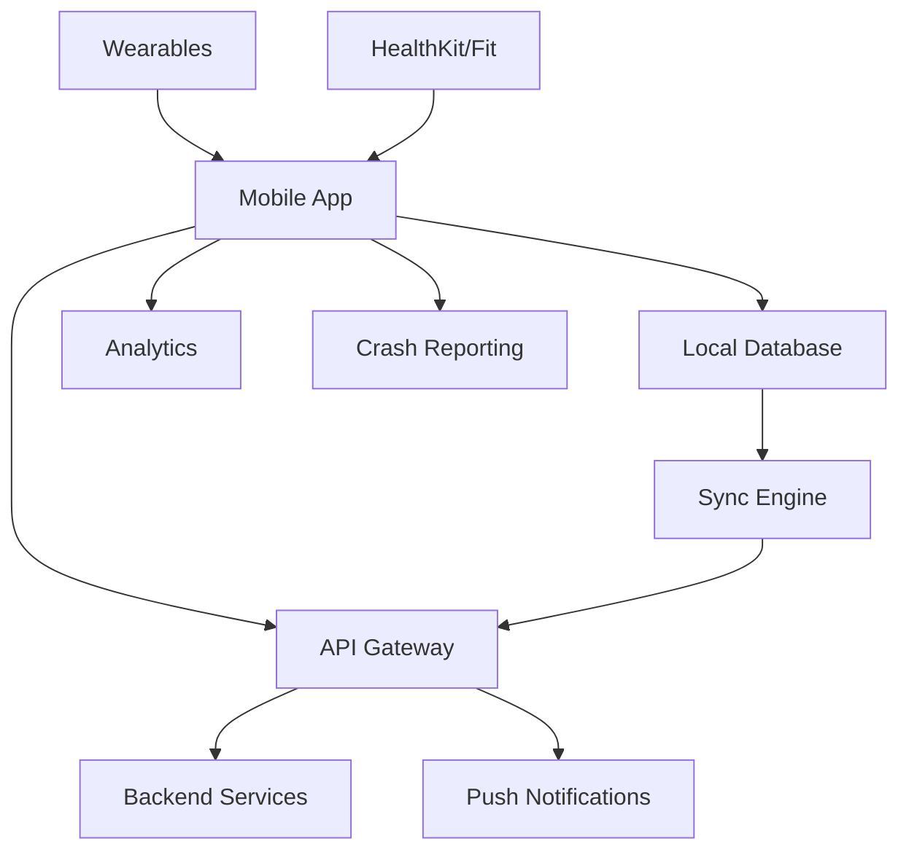

# EPIC-016: Mobile Applications Platform
**Epic ID:** EPIC-016
**Priority:** P0
**Estimated Story Points:** 89
**Projected Timeline:** Weeks 15-17 (Sprint 4.2-5.1)
**Squad:** Mobile Team

---

## 📋 Epic Overview

### Business Value Statement
The Mobile Applications Platform delivers native iOS and Android applications that provide patients and providers with comprehensive healthcare access on-the-go. By achieving 80% mobile adoption, reducing appointment booking time by 70%, and enabling 24/7 healthcare access, this platform transforms how users interact with healthcare services while maintaining full HIPAA compliance and enterprise-grade security on mobile devices.

### Strategic Objectives
1. **Universal Access:** Enable healthcare services access from any mobile device
2. **Offline Capability:** Ensure critical functions work without connectivity
3. **Native Experience:** Leverage device capabilities for optimal user experience
4. **Security First:** Implement biometric authentication and secure data storage
5. **Real-time Sync:** Maintain data consistency across all platforms
6. **Engagement Tools:** Push notifications, reminders, and proactive health alerts

### Key Stakeholders
- **Primary:** Patients, healthcare providers, caregivers
- **Secondary:** IT administrators, security teams, support staff
- **External:** App store reviewers, MDM providers, regulatory auditors

---

## 🎯 Success Criteria & KPIs

### Business Metrics
- 80% mobile adoption rate within 6 months
- 70% reduction in appointment booking time
- 60% of prescriptions refilled via mobile
- 4.5+ star rating on app stores
- 50% increase in patient engagement
- 40% reduction in no-shows via mobile reminders

### Technical Metrics
- < 2 second app launch time
- < 100ms UI response time
- 99.9% crash-free sessions
- < 50MB app size (initial download)
- Offline capability for 80% of features
- Support for iOS 14+ and Android 8+

### User Experience Metrics
- < 3 taps to complete common tasks
- 95% successful biometric authentication rate
- < 30 seconds for new user registration
- 90% task completion rate
- Support for accessibility standards
- Dark mode and customizable themes

---

## 📊 User Stories & Acceptance Criteria

### US-16.1: Cross-Platform Mobile Foundation
**As a** mobile user
**I want** native mobile apps for iOS and Android
**So that I can** access healthcare services from my preferred device

#### Acceptance Criteria:
1. **Platform Support:**
   - [ ] Native iOS app (iPhone and iPad)
   - [ ] Native Android app (phones and tablets)
   - [ ] React Native shared codebase
   - [ ] Platform-specific UI/UX guidelines
   - [ ] Tablet-optimized layouts
   - [ ] Foldable device support

2. **Core Features:**
   - [ ] User authentication and registration
   - [ ] Biometric login (Face ID, Touch ID, fingerprint)
   - [ ] Secure data storage with encryption
   - [ ] Background task processing
   - [ ] Push notifications
   - [ ] Deep linking support

3. **Performance Requirements:**
   - [ ] 60 FPS UI animations
   - [ ] < 2 second cold start
   - [ ] < 500ms screen transitions
   - [ ] Smooth scrolling with large lists
   - [ ] Efficient memory management
   - [ ] Battery usage optimization

#### Story Points: 21
#### Priority: P0

---

### US-16.2: Patient Mobile Experience
**As a** patient
**I want** full portal functionality on mobile
**So that I can** manage my healthcare from anywhere

#### Acceptance Criteria:
1. **Health Records Access:**
   - [ ] View medical records with pinch-to-zoom
   - [ ] Download and share documents
   - [ ] Lab results with trending graphs
   - [ ] Medication list with images
   - [ ] Immunization records
   - [ ] Offline viewing of cached records

2. **Appointment Management:**
   - [ ] Book appointments with provider search
   - [ ] Calendar integration
   - [ ] Location-based clinic finder
   - [ ] Check-in with QR codes
   - [ ] Telehealth video calls
   - [ ] Appointment reminders

3. **Communication Features:**
   - [ ] Secure messaging with providers
   - [ ] Photo/document attachments
   - [ ] Voice messages
   - [ ] Video consultations
   - [ ] Emergency contact button
   - [ ] Translation services

#### Story Points: 13
#### Priority: P0

---

### US-16.3: Provider Mobile Tools
**As a** healthcare provider
**I want** clinical tools on mobile
**So that I can** provide care from anywhere

#### Acceptance Criteria:
1. **Clinical Features:**
   - [ ] Patient list with smart filters
   - [ ] Clinical notes with voice dictation
   - [ ] Lab/imaging result viewer
   - [ ] Prescription writing
   - [ ] Clinical photography with annotations
   - [ ] Barcode scanning for medications

2. **Communication Tools:**
   - [ ] Provider-to-provider messaging
   - [ ] Consultation requests
   - [ ] On-call schedule viewer
   - [ ] Team collaboration spaces
   - [ ] Voice/video calling
   - [ ] Emergency broadcasts

3. **Workflow Integration:**
   - [ ] Task management
   - [ ] Rounding lists
   - [ ] Order entry
   - [ ] E-signatures
   - [ ] Clinical decision support
   - [ ] Billing/coding assistance

#### Story Points: 13
#### Priority: P0

---

### US-16.4: Offline Functionality
**As a** mobile user
**I want** the app to work offline
**So that I can** access critical features without connectivity

#### Acceptance Criteria:
1. **Offline Capabilities:**
   - [ ] View cached medical records
   - [ ] Queue messages for sending
   - [ ] Save draft appointments
   - [ ] Access medication information
   - [ ] Emergency contact information
   - [ ] Recently viewed data

2. **Data Synchronization:**
   - [ ] Automatic sync when online
   - [ ] Conflict resolution
   - [ ] Selective sync options
   - [ ] Background sync
   - [ ] Sync status indicators
   - [ ] Manual sync trigger

3. **Storage Management:**
   - [ ] Configurable cache size
   - [ ] Data priority settings
   - [ ] Automatic cleanup
   - [ ] Encrypted local storage
   - [ ] Export to device storage
   - [ ] Clear cache option

#### Story Points: 8
#### Priority: P0

---

### US-16.5: Push Notifications & Alerts
**As a** mobile user
**I want** timely notifications
**So that I** never miss important health events

#### Acceptance Criteria:
1. **Notification Types:**
   - [ ] Appointment reminders
   - [ ] Medication reminders
   - [ ] Lab result availability
   - [ ] Message notifications
   - [ ] Health tips
   - [ ] Emergency alerts

2. **Customization:**
   - [ ] Notification preferences by type
   - [ ] Quiet hours settings
   - [ ] Sound customization
   - [ ] Vibration patterns
   - [ ] LED color settings (Android)
   - [ ] Notification grouping

3. **Rich Notifications:**
   - [ ] Actionable notifications
   - [ ] Image attachments
   - [ ] Quick reply options
   - [ ] Notification history
   - [ ] Badge count management
   - [ ] Silent notifications

#### Story Points: 8
#### Priority: P0

---

### US-16.6: Wearable Device Integration
**As a** health-conscious user
**I want** wearable device integration
**So that I can** track and share health metrics

#### Acceptance Criteria:
1. **Device Support:**
   - [ ] Apple Watch app
   - [ ] Wear OS app
   - [ ] Fitbit integration
   - [ ] Garmin Connect
   - [ ] Samsung Health
   - [ ] Google Fit/Apple Health

2. **Data Synchronization:**
   - [ ] Heart rate monitoring
   - [ ] Activity tracking
   - [ ] Sleep patterns
   - [ ] Blood oxygen levels
   - [ ] ECG data (where available)
   - [ ] Fall detection alerts

3. **Wearable Features:**
   - [ ] Medication reminders on watch
   - [ ] Quick health logging
   - [ ] Emergency SOS
   - [ ] Appointment notifications
   - [ ] Activity challenges
   - [ ] Health insights

#### Story Points: 13
#### Priority: P1

---

### US-16.7: Mobile Security & Compliance
**As a** security officer
**I want** secure mobile applications
**So that** patient data remains protected on mobile devices

#### Acceptance Criteria:
1. **Security Features:**
   - [ ] Certificate pinning
   - [ ] Jailbreak/root detection
   - [ ] App integrity verification
   - [ ] Secure keychain storage
   - [ ] Session timeout
   - [ ] Remote wipe capability

2. **Compliance Requirements:**
   - [ ] HIPAA compliance
   - [ ] Data encryption at rest
   - [ ] Encrypted communications
   - [ ] Audit logging
   - [ ] Privacy policy acceptance
   - [ ] Consent management

3. **MDM Support:**
   - [ ] App wrapping support
   - [ ] VPN integration
   - [ ] Managed app configuration
   - [ ] Conditional access policies
   - [ ] MAM policies (Intune, etc.)
   - [ ] Enterprise SSO

#### Story Points: 8
#### Priority: P0

---

## 🔨 Technical Implementation Tasks

### Mobile Architecture Setup

#### Task 16.1: React Native Foundation
**Description:** Setup React Native development environment
**Assigned to:** Senior Mobile Engineer
**Priority:** P0
**Estimated Hours:** 40

**Sub-tasks:**
- [ ] Initialize React Native project with TypeScript
- [ ] Configure iOS and Android projects
- [ ] Setup navigation (React Navigation 6)
- [ ] Implement state management (Redux Toolkit/Zustand)
- [ ] Configure API client layer
- [ ] Setup error boundary and crash reporting
- [ ] Implement code push for OTA updates
- [ ] Configure build pipelines
- [ ] Setup testing framework
- [ ] Create component library

**Technical Requirements:**
```typescript
// App Architecture Setup
import React from 'react';
import { NavigationContainer } from '@react-navigation/native';
import { Provider } from 'react-redux';
import { QueryClient, QueryClientProvider } from '@tanstack/react-query';
import { SafeAreaProvider } from 'react-native-safe-area-context';
import CodePush from 'react-native-code-push';
import crashlytics from '@react-native-firebase/crashlytics';
import { store, persistor } from './store';
import { PersistGate } from 'redux-persist/integration/react';

// Configure React Query
const queryClient = new QueryClient({
  defaultOptions: {
    queries: {
      staleTime: 5 * 60 * 1000, // 5 minutes
      gcTime: 10 * 60 * 1000, // 10 minutes
      retry: 3,
      retryDelay: attemptIndex => Math.min(1000 * 2 ** attemptIndex, 30000),
    },
    mutations: {
      retry: 1,
      onError: (error) => {
        crashlytics().recordError(error as Error);
      },
    },
  },
});

// App Component with Code Push
const App: React.FC = () => {
  React.useEffect(() => {
    // Setup crash reporting
    crashlytics().setCrashlyticsCollectionEnabled(true);

    // Setup global error handler
    const errorHandler = (error: Error, isFatal: boolean) => {
      crashlytics().recordError(error);
      if (isFatal) {
        // Show error screen
        // Alert.alert('Unexpected error occurred', 'Please restart the app');
      }
    };

    ErrorUtils.setGlobalHandler(errorHandler);
  }, []);

  return (
    <Provider store={store}>
      <PersistGate loading={<SplashScreen />} persistor={persistor}>
        <QueryClientProvider client={queryClient}>
          <SafeAreaProvider>
            <NavigationContainer>
              <AuthenticationWrapper>
                <NotificationProvider>
                  <BiometricProvider>
                    <OfflineProvider>
                      <RootNavigator />
                    </OfflineProvider>
                  </BiometricProvider>
                </NotificationProvider>
              </AuthenticationWrapper>
            </NavigationContainer>
          </SafeAreaProvider>
        </QueryClientProvider>
      </PersistGate>
    </Provider>
  );
};

// Code Push configuration
const codePushOptions = {
  checkFrequency: CodePush.CheckFrequency.ON_APP_RESUME,
  installMode: CodePush.InstallMode.ON_NEXT_SUSPEND,
  minimumBackgroundDuration: 60 * 10, // 10 minutes
  mandatoryInstallMode: CodePush.InstallMode.IMMEDIATE,
};

export default CodePush(codePushOptions)(App);

// Platform-specific styling utilities
import { Platform, StyleSheet } from 'react-native';

export const createStyles = <T extends StyleSheet.NamedStyles<T>>(
  styles: T | ((theme: Theme) => T),
) => {
  return (theme: Theme) => {
    const styleObj = typeof styles === 'function' ? styles(theme) : styles;

    return StyleSheet.create({
      ...styleObj,
      // Platform-specific overrides
      ...Platform.select({
        ios: styleObj.ios || {},
        android: styleObj.android || {},
      }),
    });
  };
};

// API Service Layer
import axios, { AxiosInstance } from 'axios';
import AsyncStorage from '@react-native-async-storage/async-storage';
import NetInfo from '@react-native-community/netinfo';
import { setupCache } from 'axios-cache-interceptor';

class APIService {
  private axiosInstance: AxiosInstance;
  private offlineQueue: OfflineRequest[] = [];

  constructor() {
    this.axiosInstance = setupCache(
      axios.create({
        baseURL: Config.API_URL,
        timeout: 30000,
        headers: {
          'Content-Type': 'application/json',
          'X-Platform': Platform.OS,
          'X-App-Version': DeviceInfo.getVersion(),
        },
      }),
    );

    this.setupInterceptors();
    this.setupOfflineSync();
  }

  private setupInterceptors() {
    // Request interceptor for auth token
    this.axiosInstance.interceptors.request.use(
      async (config) => {
        const token = await AsyncStorage.getItem('auth_token');
        if (token) {
          config.headers.Authorization = `Bearer ${token}`;
        }

        // Check network connectivity
        const netInfo = await NetInfo.fetch();
        if (!netInfo.isConnected) {
          // Queue for offline
          if (this.isOfflineCapable(config)) {
            this.queueRequest(config);
            throw new OfflineError('Request queued for offline sync');
          }
        }

        return config;
      },
      (error) => Promise.reject(error),
    );

    // Response interceptor for error handling
    this.axiosInstance.interceptors.response.use(
      (response) => response,
      async (error) => {
        if (error.response?.status === 401) {
          // Token expired, refresh
          await this.refreshToken();
          return this.axiosInstance.request(error.config);
        }

        if (error.response?.status === 429) {
          // Rate limited, retry with exponential backoff
          await this.delay(error.response.headers['retry-after'] * 1000);
          return this.axiosInstance.request(error.config);
        }

        return Promise.reject(error);
      },
    );
  }

  private async setupOfflineSync() {
    // Listen for network changes
    NetInfo.addEventListener((state) => {
      if (state.isConnected && this.offlineQueue.length > 0) {
        this.syncOfflineQueue();
      }
    });
  }

  private async syncOfflineQueue() {
    const queue = [...this.offlineQueue];
    this.offlineQueue = [];

    for (const request of queue) {
      try {
        await this.axiosInstance.request(request.config);
        request.resolve(true);
      } catch (error) {
        request.reject(error);
      }
    }
  }

  // API Methods
  async getPatientData(): Promise<Patient> {
    const response = await this.axiosInstance.get('/patient/profile');
    return response.data;
  }

  async getHealthRecords(options?: RecordOptions): Promise<HealthRecord[]> {
    const response = await this.axiosInstance.get('/health-records', {
      params: options,
      cache: {
        ttl: 5 * 60 * 1000, // Cache for 5 minutes
      },
    });
    return response.data;
  }

  async bookAppointment(data: AppointmentRequest): Promise<Appointment> {
    const response = await this.axiosInstance.post('/appointments', data);
    return response.data;
  }

  async uploadDocument(file: DocumentFile): Promise<string> {
    const formData = new FormData();
    formData.append('file', {
      uri: file.uri,
      type: file.type,
      name: file.name,
    } as any);

    const response = await this.axiosInstance.post('/documents/upload', formData, {
      headers: {
        'Content-Type': 'multipart/form-data',
      },
      onUploadProgress: (progressEvent) => {
        const progress = (progressEvent.loaded / progressEvent.total) * 100;
        file.onProgress?.(progress);
      },
    });

    return response.data.url;
  }
}

export const apiService = new APIService();
```

---

#### Task 16.2: Native Module Integration
**Description:** Implement platform-specific native modules
**Assigned to:** Mobile Engineer
**Priority:** P0
**Estimated Hours:** 32

**Sub-tasks:**
- [ ] Biometric authentication module
- [ ] Secure storage implementation
- [ ] Camera/gallery integration
- [ ] Document scanner module
- [ ] Health kit/Google Fit bridge
- [ ] Notification handling
- [ ] Background tasks
- [ ] File system access
- [ ] Bluetooth integration
- [ ] NFC/QR code scanning

**Technical Requirements:**
```swift
// iOS Native Module - BiometricAuth.swift
import Foundation
import LocalAuthentication
import React

@objc(BiometricAuth)
class BiometricAuth: NSObject {

  @objc
  func authenticate(_ reason: String,
                   resolver: @escaping RCTPromiseResolveBlock,
                   rejecter: @escaping RCTPromiseRejectBlock) {

    let context = LAContext()
    var error: NSError?

    // Check if biometric authentication is available
    if context.canEvaluatePolicy(.deviceOwnerAuthenticationWithBiometrics, error: &error) {

      context.evaluatePolicy(.deviceOwnerAuthenticationWithBiometrics,
                           localizedReason: reason) { success, authError in

        DispatchQueue.main.async {
          if success {
            resolver([
              "success": true,
              "biometryType": self.getBiometryType(context)
            ])
          } else {
            let errorCode = (authError as? LAError)?.code.rawValue ?? -1
            rejecter("BIOMETRIC_AUTH_FAILED",
                    authError?.localizedDescription ?? "Authentication failed",
                    authError)
          }
        }
      }
    } else {
      rejecter("BIOMETRIC_NOT_AVAILABLE",
              error?.localizedDescription ?? "Biometric authentication not available",
              error)
    }
  }

  @objc
  func getBiometryType(_ context: LAContext) -> String {
    if #available(iOS 11.0, *) {
      switch context.biometryType {
      case .faceID:
        return "FaceID"
      case .touchID:
        return "TouchID"
      case .none:
        return "None"
      @unknown default:
        return "Unknown"
      }
    } else {
      return "TouchID"
    }
  }

  @objc
  static func requiresMainQueueSetup() -> Bool {
    return false
  }
}

// Bridge file
#import <React/RCTBridgeModule.h>

@interface RCT_EXTERN_MODULE(BiometricAuth, NSObject)

RCT_EXTERN_METHOD(authenticate:(NSString *)reason
                  resolver:(RCTPromiseResolveBlock)resolve
                  rejecter:(RCTPromiseRejectBlock)reject)

@end
```

```java
// Android Native Module - BiometricAuthModule.java
package com.healthcareapp.biometric;

import android.os.Build;
import androidx.annotation.NonNull;
import androidx.biometric.BiometricManager;
import androidx.biometric.BiometricPrompt;
import androidx.core.content.ContextCompat;
import androidx.fragment.app.FragmentActivity;

import com.facebook.react.bridge.*;
import java.util.concurrent.Executor;

public class BiometricAuthModule extends ReactContextBaseJavaModule {
    private final ReactApplicationContext reactContext;

    public BiometricAuthModule(ReactApplicationContext reactContext) {
        super(reactContext);
        this.reactContext = reactContext;
    }

    @Override
    public String getName() {
        return "BiometricAuth";
    }

    @ReactMethod
    public void authenticate(String reason, Promise promise) {
        FragmentActivity activity = (FragmentActivity) getCurrentActivity();

        if (activity == null) {
            promise.reject("NO_ACTIVITY", "No activity available");
            return;
        }

        BiometricManager biometricManager = BiometricManager.from(reactContext);

        switch (biometricManager.canAuthenticate(BiometricManager.Authenticators.BIOMETRIC_STRONG)) {
            case BiometricManager.BIOMETRIC_SUCCESS:
                performAuthentication(activity, reason, promise);
                break;
            case BiometricManager.BIOMETRIC_ERROR_NO_HARDWARE:
                promise.reject("NO_HARDWARE", "No biometric hardware available");
                break;
            case BiometricManager.BIOMETRIC_ERROR_HW_UNAVAILABLE:
                promise.reject("HW_UNAVAILABLE", "Biometric hardware unavailable");
                break;
            case BiometricManager.BIOMETRIC_ERROR_NONE_ENROLLED:
                promise.reject("NOT_ENROLLED", "No biometric credentials enrolled");
                break;
        }
    }

    private void performAuthentication(FragmentActivity activity, String reason, Promise promise) {
        Executor executor = ContextCompat.getMainExecutor(reactContext);

        BiometricPrompt biometricPrompt = new BiometricPrompt(activity, executor,
            new BiometricPrompt.AuthenticationCallback() {
                @Override
                public void onAuthenticationSucceeded(@NonNull BiometricPrompt.AuthenticationResult result) {
                    super.onAuthenticationSucceeded(result);

                    WritableMap response = Arguments.createMap();
                    response.putBoolean("success", true);
                    response.putString("biometryType", getBiometryType());
                    promise.resolve(response);
                }

                @Override
                public void onAuthenticationError(int errorCode, @NonNull CharSequence errString) {
                    super.onAuthenticationError(errorCode, errString);
                    promise.reject("AUTH_ERROR", errString.toString());
                }

                @Override
                public void onAuthenticationFailed() {
                    super.onAuthenticationFailed();
                    promise.reject("AUTH_FAILED", "Authentication failed");
                }
            });

        BiometricPrompt.PromptInfo promptInfo = new BiometricPrompt.PromptInfo.Builder()
            .setTitle("Authenticate")
            .setSubtitle(reason)
            .setNegativeButtonText("Cancel")
            .setConfirmationRequired(false)
            .build();

        activity.runOnUiThread(() -> biometricPrompt.authenticate(promptInfo));
    }

    private String getBiometryType() {
        if (Build.VERSION.SDK_INT >= Build.VERSION_CODES.Q) {
            // Could be face, fingerprint, or iris
            return "Biometric";
        } else {
            return "Fingerprint";
        }
    }
}
```

---

#### Task 16.3: Patient App UI Development
**Description:** Build patient-facing mobile interface
**Assigned to:** Mobile UI Developer
**Priority:** P0
**Estimated Hours:** 48

**Sub-tasks:**
- [ ] Create authentication screens
- [ ] Build dashboard layout
- [ ] Implement health records viewer
- [ ] Create appointment booking flow
- [ ] Build messaging interface
- [ ] Implement prescription management
- [ ] Create billing screens
- [ ] Build settings/preferences
- [ ] Implement accessibility features
- [ ] Create onboarding flow

**Technical Requirements:**
```typescript
// Patient Dashboard Screen
import React, { useState, useCallback, useEffect } from 'react';
import {
  View,
  ScrollView,
  RefreshControl,
  StyleSheet,
  Platform,
} from 'react-native';
import {
  Text,
  Card,
  Avatar,
  Button,
  Surface,
  useTheme,
} from 'react-native-paper';
import { SafeAreaView } from 'react-native-safe-area-context';
import Animated, {
  FadeInDown,
  FadeInRight,
  useAnimatedStyle,
  useSharedValue,
  withSpring,
} from 'react-native-reanimated';
import { usePatientData } from '@/hooks/usePatientData';
import { useNavigation } from '@react-navigation/native';

export const PatientDashboard: React.FC = () => {
  const theme = useTheme();
  const navigation = useNavigation();
  const { patient, appointments, medications, refetch, isLoading } = usePatientData();
  const [refreshing, setRefreshing] = useState(false);

  const onRefresh = useCallback(async () => {
    setRefreshing(true);
    await refetch();
    setRefreshing(false);
  }, [refetch]);

  // Animated header
  const scrollY = useSharedValue(0);
  const headerStyle = useAnimatedStyle(() => ({
    transform: [
      {
        translateY: withSpring(scrollY.value * -0.5),
      },
    ],
  }));

  return (
    <SafeAreaView style={styles.container}>
      <ScrollView
        refreshControl={
          <RefreshControl refreshing={refreshing} onRefresh={onRefresh} />
        }
        onScroll={(event) => {
          scrollY.value = event.nativeEvent.contentOffset.y;
        }}
        scrollEventThrottle={16}
      >
        {/* Animated Header */}
        <Animated.View style={[styles.header, headerStyle]}>
          <View style={styles.headerContent}>
            <Avatar.Image
              size={80}
              source={{ uri: patient?.photoUrl }}
              style={styles.avatar}
            />
            <View style={styles.headerText}>
              <Text variant="headlineSmall" style={styles.greeting}>
                {getGreeting()}, {patient?.firstName}!
              </Text>
              <Text variant="bodyMedium" style={styles.subGreeting}>
                {getHealthMessage(patient)}
              </Text>
            </View>
          </View>
        </Animated.View>

        {/* Quick Actions */}
        <Animated.View
          entering={FadeInDown.delay(100).duration(600)}
          style={styles.quickActions}
        >
          <Text variant="titleMedium" style={styles.sectionTitle}>
            Quick Actions
          </Text>
          <ScrollView
            horizontal
            showsHorizontalScrollIndicator={false}
            style={styles.actionScroll}
          >
            {quickActions.map((action, index) => (
              <QuickActionCard
                key={action.id}
                action={action}
                onPress={() => navigation.navigate(action.route)}
                delay={index * 50}
              />
            ))}
          </ScrollView>
        </Animated.View>

        {/* Upcoming Appointments */}
        <Animated.View
          entering={FadeInRight.delay(200).duration(600)}
          style={styles.section}
        >
          <SectionHeader
            title="Upcoming Appointments"
            count={appointments?.length || 0}
            onViewAll={() => navigation.navigate('Appointments')}
          />
          {appointments?.slice(0, 2).map((appointment) => (
            <AppointmentCard
              key={appointment.id}
              appointment={appointment}
              onPress={() => handleAppointmentPress(appointment)}
            />
          ))}
        </Animated.View>

        {/* Medications */}
        <Animated.View
          entering={FadeInRight.delay(300).duration(600)}
          style={styles.section}
        >
          <SectionHeader
            title="Today's Medications"
            onViewAll={() => navigation.navigate('Medications')}
          />
          <MedicationReminders medications={medications} />
        </Animated.View>

        {/* Health Metrics */}
        <Animated.View
          entering={FadeInRight.delay(400).duration(600)}
          style={styles.section}
        >
          <SectionHeader
            title="Health Metrics"
            onViewAll={() => navigation.navigate('HealthRecords')}
          />
          <HealthMetricsCard metrics={patient?.healthMetrics} />
        </Animated.View>
      </ScrollView>

      {/* Floating Action Button */}
      <FAB
        icon="plus"
        style={[styles.fab, { backgroundColor: theme.colors.primary }]}
        onPress={handleFABPress}
      />
    </SafeAreaView>
  );
};

// Quick Action Card Component
const QuickActionCard: React.FC<{
  action: QuickAction;
  onPress: () => void;
  delay: number;
}> = ({ action, onPress, delay }) => {
  const theme = useTheme();

  return (
    <Animated.View entering={FadeInDown.delay(delay).duration(400)}>
      <TouchableRipple onPress={onPress} style={styles.actionCard}>
        <Surface style={styles.actionSurface} elevation={2}>
          <Icon name={action.icon} size={32} color={theme.colors.primary} />
          <Text variant="labelMedium" style={styles.actionLabel}>
            {action.label}
          </Text>
        </Surface>
      </TouchableRipple>
    </Animated.View>
  );
};

// Appointment Card Component
const AppointmentCard: React.FC<{
  appointment: Appointment;
  onPress: () => void;
}> = ({ appointment, onPress }) => {
  const theme = useTheme();

  return (
    <Card style={styles.appointmentCard} onPress={onPress}>
      <Card.Content>
        <View style={styles.appointmentHeader}>
          <Avatar.Text
            size={40}
            label={appointment.providerName[0]}
            style={{ backgroundColor: theme.colors.primaryContainer }}
          />
          <View style={styles.appointmentInfo}>
            <Text variant="titleMedium">{appointment.providerName}</Text>
            <Text variant="bodyMedium" style={styles.appointmentSpecialty}>
              {appointment.specialty}
            </Text>
          </View>
          {appointment.isVirtual && (
            <Chip icon="video" style={styles.virtualChip}>
              Virtual
            </Chip>
          )}
        </View>

        <View style={styles.appointmentDetails}>
          <View style={styles.detailRow}>
            <Icon name="calendar" size={16} color={theme.colors.onSurfaceVariant} />
            <Text variant="bodyMedium" style={styles.detailText}>
              {formatDate(appointment.dateTime)}
            </Text>
          </View>
          <View style={styles.detailRow}>
            <Icon name="clock" size={16} color={theme.colors.onSurfaceVariant} />
            <Text variant="bodyMedium" style={styles.detailText}>
              {formatTime(appointment.dateTime)}
            </Text>
          </View>
          {!appointment.isVirtual && (
            <View style={styles.detailRow}>
              <Icon name="map-marker" size={16} color={theme.colors.onSurfaceVariant} />
              <Text variant="bodyMedium" style={styles.detailText}>
                {appointment.location}
              </Text>
            </View>
          )}
        </View>

        <View style={styles.appointmentActions}>
          <Button
            mode="outlined"
            onPress={() => handleReschedule(appointment)}
            style={styles.actionButton}
          >
            Reschedule
          </Button>
          {appointment.isVirtual ? (
            <Button
              mode="contained"
              onPress={() => handleJoinVideo(appointment)}
              style={styles.actionButton}
            >
              Join Call
            </Button>
          ) : (
            <Button
              mode="contained"
              onPress={() => handleCheckIn(appointment)}
              style={styles.actionButton}
            >
              Check In
            </Button>
          )}
        </View>
      </Card.Content>
    </Card>
  );
};

// Health Records Viewer
const HealthRecordsViewer: React.FC = () => {
  const [selectedCategory, setSelectedCategory] = useState<string>('all');
  const { records, isLoading } = useHealthRecords(selectedCategory);

  return (
    <View style={styles.container}>
      {/* Category Filter */}
      <ScrollView
        horizontal
        showsHorizontalScrollIndicator={false}
        style={styles.categoryFilter}
      >
        {categories.map((category) => (
          <Chip
            key={category.id}
            selected={selectedCategory === category.id}
            onPress={() => setSelectedCategory(category.id)}
            style={styles.categoryChip}
          >
            {category.label}
          </Chip>
        ))}
      </ScrollView>

      {/* Records List */}
      <FlashList
        data={records}
        renderItem={({ item }) => <RecordItem record={item} />}
        estimatedItemSize={100}
        ItemSeparatorComponent={() => <View style={styles.separator} />}
        ListEmptyComponent={
          <EmptyState
            title="No records found"
            message="Your health records will appear here"
            icon="file-document"
          />
        }
      />
    </View>
  );
};

const styles = StyleSheet.create({
  container: {
    flex: 1,
    backgroundColor: '#f5f5f5',
  },
  header: {
    padding: 20,
    paddingTop: Platform.OS === 'ios' ? 0 : 20,
    backgroundColor: '#fff',
    borderBottomLeftRadius: 24,
    borderBottomRightRadius: 24,
    ...Platform.select({
      ios: {
        shadowColor: '#000',
        shadowOffset: { width: 0, height: 2 },
        shadowOpacity: 0.1,
        shadowRadius: 8,
      },
      android: {
        elevation: 4,
      },
    }),
  },
  headerContent: {
    flexDirection: 'row',
    alignItems: 'center',
  },
  avatar: {
    marginRight: 16,
  },
  headerText: {
    flex: 1,
  },
  greeting: {
    fontWeight: '600',
  },
  subGreeting: {
    opacity: 0.7,
    marginTop: 4,
  },
  quickActions: {
    marginTop: 20,
  },
  sectionTitle: {
    paddingHorizontal: 20,
    marginBottom: 12,
    fontWeight: '600',
  },
  actionScroll: {
    paddingHorizontal: 16,
  },
  actionCard: {
    marginHorizontal: 4,
  },
  actionSurface: {
    padding: 16,
    borderRadius: 12,
    alignItems: 'center',
    width: 80,
  },
  actionLabel: {
    marginTop: 8,
    textAlign: 'center',
  },
  section: {
    marginTop: 24,
  },
  appointmentCard: {
    marginHorizontal: 20,
    marginBottom: 12,
  },
  fab: {
    position: 'absolute',
    margin: 16,
    right: 0,
    bottom: 0,
  },
});
```

---

#### Task 16.4: Provider App Development
**Description:** Build provider-specific mobile features
**Assigned to:** Mobile Developer
**Priority:** P0
**Estimated Hours:** 40

**Sub-tasks:**
- [ ] Provider authentication flow
- [ ] Patient list management
- [ ] Clinical note taking
- [ ] Order entry interface
- [ ] Prescription writing
- [ ] Lab result viewer
- [ ] Team messaging
- [ ] On-call management
- [ ] Task management
- [ ] Billing/coding tools

---

### Offline & Sync

#### Task 16.5: Offline Data Management
**Description:** Implement comprehensive offline support
**Assigned to:** Mobile Engineer
**Priority:** P0
**Estimated Hours:** 32

**Sub-tasks:**
- [ ] Setup local database (SQLite/Realm)
- [ ] Implement data caching strategy
- [ ] Build sync engine
- [ ] Handle conflict resolution
- [ ] Create queue management
- [ ] Implement delta sync
- [ ] Build compression
- [ ] Setup encryption
- [ ] Create backup system
- [ ] Implement recovery

**Technical Requirements:**
```typescript
// Offline Data Manager
import SQLite from 'react-native-sqlite-storage';
import NetInfo from '@react-native-community/netinfo';
import AsyncStorage from '@react-native-async-storage/async-storage';
import { encrypt, decrypt } from '@/utils/crypto';

interface SyncOperation {
  id: string;
  type: 'CREATE' | 'UPDATE' | 'DELETE';
  entity: string;
  data: any;
  timestamp: number;
  retries: number;
}

class OfflineDataManager {
  private db: SQLite.SQLiteDatabase | null = null;
  private syncQueue: SyncOperation[] = [];
  private isSyncing = false;
  private listeners: Map<string, Set<Function>> = new Map();

  async initialize() {
    // Open encrypted database
    this.db = await SQLite.openDatabase({
      name: 'healthcare.db',
      location: 'default',
      key: await this.getDatabaseKey(),
    });

    await this.createTables();
    await this.loadSyncQueue();

    // Monitor network changes
    NetInfo.addEventListener(this.handleNetworkChange);
  }

  private async createTables() {
    const tables = [
      `CREATE TABLE IF NOT EXISTS patients (
        id TEXT PRIMARY KEY,
        data TEXT,
        last_synced INTEGER,
        is_dirty INTEGER DEFAULT 0
      )`,
      `CREATE TABLE IF NOT EXISTS appointments (
        id TEXT PRIMARY KEY,
        patient_id TEXT,
        data TEXT,
        last_synced INTEGER,
        is_dirty INTEGER DEFAULT 0
      )`,
      `CREATE TABLE IF NOT EXISTS health_records (
        id TEXT PRIMARY KEY,
        patient_id TEXT,
        type TEXT,
        data TEXT,
        last_synced INTEGER
      )`,
      `CREATE TABLE IF NOT EXISTS sync_queue (
        id TEXT PRIMARY KEY,
        operation TEXT,
        entity TEXT,
        data TEXT,
        timestamp INTEGER,
        retries INTEGER DEFAULT 0
      )`,
      `CREATE TABLE IF NOT EXISTS sync_metadata (
        entity TEXT PRIMARY KEY,
        last_sync_token TEXT,
        last_sync_time INTEGER
      )`,
    ];

    for (const table of tables) {
      await this.db.executeSql(table);
    }
  }

  // Save data locally with encryption
  async saveLocal<T>(
    entity: string,
    id: string,
    data: T,
    markDirty = true,
  ): Promise<void> {
    const encrypted = await encrypt(JSON.stringify(data));

    const query = `
      INSERT OR REPLACE INTO ${entity} (id, data, last_synced, is_dirty)
      VALUES (?, ?, ?, ?)
    `;

    await this.db.executeSql(query, [
      id,
      encrypted,
      Date.now(),
      markDirty ? 1 : 0,
    ]);

    // Add to sync queue if marked dirty
    if (markDirty) {
      await this.addToSyncQueue({
        type: 'UPDATE',
        entity,
        data: { id, ...data },
      });
    }

    // Notify listeners
    this.notifyListeners(entity, { id, data });
  }

  // Retrieve local data with decryption
  async getLocal<T>(entity: string, id: string): Promise<T | null> {
    const query = `SELECT data FROM ${entity} WHERE id = ?`;
    const [result] = await this.db.executeSql(query, [id]);

    if (result.rows.length === 0) {
      return null;
    }

    const encrypted = result.rows.item(0).data;
    const decrypted = await decrypt(encrypted);
    return JSON.parse(decrypted);
  }

  // Query local data
  async queryLocal<T>(
    entity: string,
    conditions?: any,
  ): Promise<T[]> {
    let query = `SELECT id, data FROM ${entity}`;
    const params: any[] = [];

    if (conditions) {
      const whereClause = Object.keys(conditions)
        .map((key) => {
          params.push(conditions[key]);
          return `${key} = ?`;
        })
        .join(' AND ');
      query += ` WHERE ${whereClause}`;
    }

    const [result] = await this.db.executeSql(query, params);
    const items: T[] = [];

    for (let i = 0; i < result.rows.length; i++) {
      const row = result.rows.item(i);
      const decrypted = await decrypt(row.data);
      items.push(JSON.parse(decrypted));
    }

    return items;
  }

  // Add operation to sync queue
  private async addToSyncQueue(operation: Omit<SyncOperation, 'id' | 'timestamp' | 'retries'>) {
    const syncOp: SyncOperation = {
      id: generateUUID(),
      ...operation,
      timestamp: Date.now(),
      retries: 0,
    };

    const query = `
      INSERT INTO sync_queue (id, operation, entity, data, timestamp, retries)
      VALUES (?, ?, ?, ?, ?, ?)
    `;

    await this.db.executeSql(query, [
      syncOp.id,
      syncOp.type,
      syncOp.entity,
      JSON.stringify(syncOp.data),
      syncOp.timestamp,
      syncOp.retries,
    ]);

    this.syncQueue.push(syncOp);

    // Try immediate sync if online
    const netInfo = await NetInfo.fetch();
    if (netInfo.isConnected) {
      this.startSync();
    }
  }

  // Sync engine
  private async startSync() {
    if (this.isSyncing) return;

    this.isSyncing = true;

    try {
      // Process sync queue
      while (this.syncQueue.length > 0) {
        const operation = this.syncQueue.shift()!;

        try {
          await this.executeSyncOperation(operation);
          await this.removefromSyncQueue(operation.id);
        } catch (error) {
          // Retry logic
          if (operation.retries < 3) {
            operation.retries++;
            this.syncQueue.push(operation);
            await this.updateSyncQueueRetries(operation);
          } else {
            // Move to dead letter queue
            await this.moveToDeadLetter(operation);
          }
        }
      }

      // Pull latest changes
      await this.pullChanges();

    } finally {
      this.isSyncing = false;
    }
  }

  // Execute sync operation
  private async executeSyncOperation(operation: SyncOperation) {
    const api = getAPIClient();

    switch (operation.type) {
      case 'CREATE':
        await api.post(`/${operation.entity}`, operation.data);
        break;
      case 'UPDATE':
        await api.put(`/${operation.entity}/${operation.data.id}`, operation.data);
        break;
      case 'DELETE':
        await api.delete(`/${operation.entity}/${operation.data.id}`);
        break;
    }
  }

  // Pull changes from server
  private async pullChanges() {
    const entities = ['patients', 'appointments', 'health_records'];

    for (const entity of entities) {
      const lastSyncToken = await this.getLastSyncToken(entity);
      const changes = await this.fetchChanges(entity, lastSyncToken);

      for (const change of changes.items) {
        await this.applyChange(entity, change);
      }

      await this.updateSyncToken(entity, changes.nextToken);
    }
  }

  // Conflict resolution
  private async resolveConflict(
    local: any,
    remote: any,
    entity: string,
  ): Promise<any> {
    // Strategy: Last-write-wins with field-level merge
    const localTime = local.updatedAt || local.lastModified;
    const remoteTime = remote.updatedAt || remote.lastModified;

    if (localTime > remoteTime) {
      // Local wins, but merge certain fields
      return this.mergeFields(local, remote, entity);
    } else {
      // Remote wins
      return remote;
    }
  }

  // Handle network change
  private handleNetworkChange = (state: NetInfoState) => {
    if (state.isConnected && !this.isSyncing) {
      this.startSync();
    }
  };

  // Subscribe to changes
  subscribe(entity: string, callback: Function): () => void {
    if (!this.listeners.has(entity)) {
      this.listeners.set(entity, new Set());
    }

    this.listeners.get(entity)!.add(callback);

    // Return unsubscribe function
    return () => {
      this.listeners.get(entity)?.delete(callback);
    };
  }

  private notifyListeners(entity: string, data: any) {
    this.listeners.get(entity)?.forEach(callback => callback(data));
  }

  // Storage management
  async getStorageInfo(): Promise<StorageInfo> {
    const [result] = await this.db.executeSql(`
      SELECT
        SUM(LENGTH(data)) as totalSize,
        COUNT(*) as recordCount
      FROM (
        SELECT data FROM patients
        UNION ALL
        SELECT data FROM appointments
        UNION ALL
        SELECT data FROM health_records
      )
    `);

    return {
      totalSize: result.rows.item(0).totalSize || 0,
      recordCount: result.rows.item(0).recordCount || 0,
      cacheSize: await this.getCacheSize(),
      availableSpace: await this.getAvailableSpace(),
    };
  }

  async clearCache(olderThan?: Date): Promise<void> {
    const cutoff = olderThan || new Date(Date.now() - 30 * 24 * 60 * 60 * 1000);

    await this.db.executeSql(`
      DELETE FROM health_records
      WHERE last_synced < ?
    `, [cutoff.getTime()]);

    // Clear image cache
    await this.clearImageCache(cutoff);
  }
}

export const offlineManager = new OfflineDataManager();
```

---

#### Task 16.6: Push Notifications
**Description:** Implement push notification system
**Assigned to:** Mobile Engineer
**Priority:** P0
**Estimated Hours:** 24

**Sub-tasks:**
- [ ] Setup Firebase Cloud Messaging
- [ ] Configure Apple Push Notifications
- [ ] Build notification handlers
- [ ] Implement deep linking
- [ ] Create notification preferences
- [ ] Build local notifications
- [ ] Setup notification analytics
- [ ] Implement rich notifications
- [ ] Create notification history
- [ ] Build silent notifications

---

### Platform Features

#### Task 16.7: Wearable Integration
**Description:** Integrate with wearable devices
**Assigned to:** Mobile Engineer
**Priority:** P1
**Estimated Hours:** 32

**Sub-tasks:**
- [ ] Apple Watch app development
- [ ] Wear OS app development
- [ ] HealthKit integration
- [ ] Google Fit integration
- [ ] Fitbit API integration
- [ ] Heart rate monitoring
- [ ] Activity tracking
- [ ] Sleep analysis
- [ ] Emergency detection
- [ ] Medication reminders

---

#### Task 16.8: Accessibility Implementation
**Description:** Ensure full accessibility compliance
**Assigned to:** Mobile UI Developer
**Priority:** P0
**Estimated Hours:** 24

**Sub-tasks:**
- [ ] Screen reader support
- [ ] Voice control integration
- [ ] High contrast mode
- [ ] Font size adjustment
- [ ] Color blind modes
- [ ] Haptic feedback
- [ ] Audio descriptions
- [ ] Keyboard navigation
- [ ] Focus management
- [ ] WCAG compliance

---

### Security & Compliance

#### Task 16.9: Mobile Security
**Description:** Implement comprehensive security measures
**Assigned to:** Security Engineer
**Priority:** P0
**Estimated Hours:** 32

**Sub-tasks:**
- [ ] Certificate pinning
- [ ] Anti-tampering measures
- [ ] Root/jailbreak detection
- [ ] App obfuscation
- [ ] Secure storage
- [ ] Session management
- [ ] API security
- [ ] Code signing
- [ ] Security scanning
- [ ] Penetration testing

---

#### Task 16.10: MDM/MAM Support
**Description:** Enterprise mobile management integration
**Assigned to:** Mobile Engineer
**Priority:** P1
**Estimated Hours:** 24

**Sub-tasks:**
- [ ] Intune integration
- [ ] AirWatch support
- [ ] MobileIron compatibility
- [ ] App wrapping support
- [ ] VPN configuration
- [ ] Conditional access
- [ ] Remote wipe capability
- [ ] Policy enforcement
- [ ] SSO integration
- [ ] Compliance reporting

---

### Testing & Deployment

#### Task 16.11: Mobile Testing Framework
**Description:** Setup comprehensive testing
**Assigned to:** QA Engineer
**Priority:** P0
**Estimated Hours:** 32

**Sub-tasks:**
- [ ] Unit test setup (Jest)
- [ ] Integration testing
- [ ] E2E testing (Detox)
- [ ] Performance testing
- [ ] Device testing matrix
- [ ] Automated UI testing
- [ ] API mocking
- [ ] Crash testing
- [ ] Beta testing program
- [ ] User acceptance testing

---

#### Task 16.12: App Store Deployment
**Description:** Prepare and deploy to app stores
**Assigned to:** DevOps Engineer
**Priority:** P0
**Estimated Hours:** 24

**Sub-tasks:**
- [ ] App Store preparation
- [ ] Google Play preparation
- [ ] App signing setup
- [ ] Store listings creation
- [ ] Screenshot generation
- [ ] App preview videos
- [ ] Privacy policy
- [ ] Terms of service
- [ ] Beta deployment
- [ ] Production release

---

## 📐 Technical Architecture

### Mobile Architecture
```yaml
mobile_platform:
  frontend:
    framework: "React Native 0.72+"
    state_management: "Redux Toolkit + RTK Query"
    navigation: "React Navigation 6"
    ui_library: "React Native Paper"
    animations: "Reanimated 3"

  native_modules:
    biometrics: "Local Authentication"
    secure_storage: "Keychain/Keystore"
    health_data: "HealthKit/Google Fit"
    payments: "Apple Pay/Google Pay"

  offline:
    database: "SQLite/WatermelonDB"
    sync_engine: "Custom Delta Sync"
    caching: "AsyncStorage + MMKV"

  notifications:
    push: "Firebase Cloud Messaging"
    local: "Notifee"
    deep_linking: "React Navigation Linking"

  security:
    encryption: "react-native-crypto"
    certificate_pinning: "TrustKit"
    obfuscation: "ProGuard/R8"

  analytics:
    crashes: "Firebase Crashlytics"
    analytics: "Mixpanel"
    performance: "Firebase Performance"

  deployment:
    code_push: "Microsoft CodePush"
    ci_cd: "Fastlane + GitHub Actions"
    distribution: "App Store Connect/Google Play Console"
```

### Data Flow Architecture


---

## 🔒 Security Considerations

### Mobile Security Requirements
1. **App Security:**
   - Code obfuscation and minification
   - Anti-debugging protection
   - Runtime application self-protection (RASP)
   - Binary packing

2. **Data Security:**
   - AES-256 encryption for local storage
   - Secure key management
   - Certificate pinning for API calls
   - No sensitive data in logs

3. **Authentication:**
   - Biometric authentication
   - Multi-factor authentication
   - Secure token storage
   - Session timeout management

4. **Compliance:**
   - HIPAA compliance for health data
   - GDPR for EU users
   - CCPA for California users
   - App store guidelines

---

## 🧪 Testing Strategy

### Mobile Testing Approach
1. **Unit Testing:**
   - Component testing with Jest
   - Business logic testing
   - Native module testing
   - Utility function testing

2. **Integration Testing:**
   - API integration tests
   - Database operations
   - Native bridge testing
   - Third-party SDK testing

3. **E2E Testing:**
   - User flow testing with Detox
   - Cross-platform scenarios
   - Offline/online transitions
   - Deep linking flows

4. **Device Testing:**
   - Multiple iOS versions (14+)
   - Multiple Android versions (8+)
   - Tablet optimization
   - Different screen sizes

---

## 📋 Rollout Plan

### Phase 1: MVP Release (Weeks 1-2)
- Basic authentication
- Health records viewing
- Appointment display
- Simple messaging
- iOS and Android beta

### Phase 2: Core Features (Weeks 3-4)
- Full appointment booking
- Prescription management
- Push notifications
- Offline support
- Wearable integration

### Phase 3: Advanced Features (Week 5)
- Video consultations
- Advanced health tracking
- Provider tools
- Payment integration
- Family access

### Phase 4: Production Release (Week 6)
- App store submission
- Marketing launch
- User onboarding
- Support setup
- Analytics tracking

---

## 📊 Success Metrics

### Week 1 Targets
- Beta apps deployed
- 100 test users
- Core features working
- < 1% crash rate

### Month 1 Targets
- App store approval
- 1,000 downloads
- 4.0+ rating
- 80% retention rate

### Quarter 1 Targets
- 10,000+ active users
- 4.5+ star rating
- 80% mobile adoption
- 50% engagement increase

---

## 🔗 Dependencies

### Technical Dependencies
- EPIC-014: Patient Portal (API backend)
- EPIC-015: Provider Collaboration
- EPIC-013: Omnichannel Communications
- EPIC-001: Real-time Infrastructure

### External Dependencies
- App Store Developer Account
- Google Play Developer Account
- Firebase project setup
- Code signing certificates
- Push notification certificates

### Resource Dependencies
- 2 Mobile Engineers
- 1 UI/UX Designer
- 1 QA Engineer
- 1 DevOps Engineer

---

## 📝 Notes

### Key Decisions
- Chose React Native for code reuse
- Implemented offline-first architecture
- Native modules for critical features
- Biometric authentication as default

### Risks & Mitigations
- **Risk:** App store rejection
  - **Mitigation:** Follow guidelines strictly, beta testing

- **Risk:** Performance issues
  - **Mitigation:** Native modules for heavy operations

- **Risk:** Security vulnerabilities
  - **Mitigation:** Regular security audits and penetration testing

---

**Epic Status:** Ready for Implementation
**Last Updated:** November 24, 2024
**Next Review:** Sprint Planning